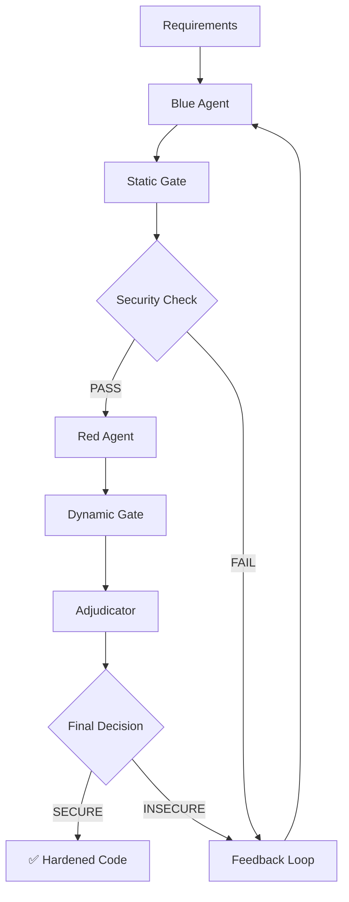

# Auto Project Index

Generated: 2026-05-06T21:10:07.159Z

This file is generated from safe project metadata, README-style docs, package manifests, and GitHub repository metadata. It intentionally excludes source dumps, .env files, build outputs, node_modules, and git internals.

# Local Documents Projects
## 7ala c code
Path: 7ala c code
Markers: README.md

README.md
# 🏢 Workspace Booking Database Management System

A professional web-based database management system built entirely in C with a modern HTML/CSS frontend.

## ✨ Features

### 🌐 Web Interface
- **Modern UI**: Professional gradient design with responsive layout
- **Beautiful Tables**: Organized data display with alternating row colors
- **Real-time Updates**: Dynamic data integration with C backend
- **Mobile Friendly**: Works on all devices and screen sizes

### 🎯 Core Functionality
- **➕ Add Users**: Complete user registration with validation
- **🔍 Search**: Fast user lookup by ID with clean results display
- **📋 List All**: Beautiful table view of all users with action buttons
- **👨‍💼 Admin Panel**: Professional admin dashboard with management tools
- **💾 Database Operations**: Save/Load database functionality

### 🔧 Technical Features
- **Pure C Backend**: No external dependencies, just standard C libraries
- **HTTP Server**: Built-in web server with multi-client support
- **CSV Database**: Simple, reliable file-based data storage
- **Process Management**: Proper fork/exec handling for concurrent requests
- **Error Handling**: Comprehensive error checking and user feedback

## 🚀 Quick Start

### Prerequisites
- GCC compiler
- Linux/Unix environment
- Web browser (Chrome, Firefox, Brave, etc.)

### Installation & Running

1. **Compile the programs:**
   ```bash
   gcc -o dbms dbms.c
   gcc -o web_interface web_interface.c
   ```

2. **Create database directory:**
   ```bash
   mkdir -p database
   ```

3. **Start the web server:**
   ```bash
   ./web_interface
   ```

4. **Access the interface:**
   Open your browser and go to: **http://localhost:8080**

## 📁 File Structure

```
workspace-booking-dbms/
├── dbms.c                 # Core database management sy

## TerbalStation
Path: 7ala car website/TerbalStation
Markers: README.md, package.json

README.md
# Terbal Station

**Terbal Station** is a premium e-commerce platform for automotive storage solutions including car covers, motorbike covers, storage pods, and accessories. Built with modern web technologies for a seamless customer and admin experience.

## 🚀 Features

### Customer Features
- **Premium Product Catalog**: Browse car covers, motorbike covers, storage solutions, and accessories
- **User Authentication**: Secure sign-in/sign-up system with role-based access
- **Shopping Cart**: Add products, customize options, and manage cart state
- **Quote System**: Request custom quotes for specific needs
- **Newsletter Subscription**: Stay updated with latest products and offers
- **Responsive Design**: Optimized for desktop and mobile devices

### Admin Panel Features
- **Dashboard**: Overview of orders, products, and key metrics
- **Product Management**: Add, edit, delete products with image uploads
- **Order Management**: View and manage customer orders
- **User Management**: Monitor customer accounts and roles
- **Image Upload**: Secure storage with Supabase Storage integration
- **Real-time Updates**: Live data synchronization across admin panel

## 🛠️ Technology Stack

### Core Technologies
- **[Next.js 15](https://nextjs.org)** - App Router with Turbopack for faster builds
- **[TypeScript 5](https://www.typescriptlang.org/)** - Type-safe development with strict configuration
- **[Supabase](https://supabase.com/)** - Backend-as-a-Service for database, auth, and storage
- **[Tailwind CSS v4](https://tailwindcss.com/)** - Utility-first CSS framework
- **[shadcn/ui](https://ui.shadcn.com/)** - Modern React component library
- **[Framer Motion](https://www.framer.com/motion/)** - Smooth animations and interactions

### Key Libraries
- **Lucide React** - Icon librar


package.json
Package: terbal-station-frontend
Notable packages: @hookform/resolvers, @radix-ui/react-avatar, @radix-ui/react-checkbox, @radix-ui/react-dialog, @radix-ui/react-dropdown-menu, @radix-ui/react-label, @radix-ui/react-navigation-menu, @radix-ui/react-scroll-area, @radix-ui/react-select, @radix-ui/react-separator, @radix-ui/react-slot, @radix-ui/react-tabs, @stripe/react-stripe-js, @stripe/stripe-js, @supabase/ssr, @supabase/supabase-js, @tabler/icons-react, @vercel/analytics
Scripts: dev, build, start, lint

## adversarial-verification-framework
Path: adversarial-verification-framework
Markers: README.md

README.md
# 🛡️ Adversarial Verification Framework

[](https://www.python.org/downloads/)
[](https://opensource.org/licenses/MIT)
[](https://github.com/yourusername/adversarial-verification-framework)

> **A production-ready security framework that uses adversarial testing to verify and harden LLM-generated code before deployment.**

Never deploy insecure AI-generated code again. This framework implements a multi-agent adversarial verification loop that automatically detects vulnerabilities, generates exploits, and iteratively hardens code until it meets enterprise security standards.

## 🎯 Why This Matters

LLM-generated code often contains subtle security vulnerabilities that traditional testing misses. This framework solves that by:

- **� Muclti-Layer Security Analysis** - Static AST analysis + Dynamic runtime testing + Adversarial fuzzing
- **🔄 Iterative Hardening** - Automatically regenerates and improves code based on security feedback  
- **🚫 Fail-Closed Design** - Never returns insecure code to production
- **⚡ Production Ready** - REST API, comprehensive logging, enterprise-grade security policies

## 🏗️ Architecture Overview



### Core Components

| Component | Purpose | Key Features |
|-----------|---------|--------------|
| **🔵 Blue Agent** |

## secure-llm
Path: adversarial-verification-framework/secure-llm
Markers: README.md, package.json

README.md
# Adversarial Code Generator VS Code Extension

A VS Code extension that connects to your Adversarial Verification Framework to generate secure, verified code directly in your workspace.

## Features

- **Secure Code Generation**: Uses your adversarial verification framework to generate secure code
- **Security Verification**: All generated code is verified against security invariants
- **File Generation**: Automatically creates code files and security reports in your workspace
- **Status Reporting**: Shows verification status (PASS/WARN/FAIL) and confidence levels
- **Multi-language Support**: Detects and generates code in various programming languages

## Quick Start

### 1. Start Your Adversarial Verification Server

```bash
cd /path/to/your/adversarial-verification-framework
python api/server.py
```

The server will start on `http://localhost:5000`

### 2. Install Extension Dependencies

```bash
cd secure-llm
npm install
```

### 3. Run the Extension

1. Open VS Code
2. Press `F5` to launch Extension Development Host
3. In the new window, open a workspace/folder
4. Use any of the activation methods below

## How to Use

### Multiple Ways to Access:

1. **Status Bar**: Click "Adversarial" button (bottom-right)
2. **Keyboard Shortcut**: `Cmd+Shift+L` (Mac) / `Ctrl+Shift+L` (Windows/Linux)
3. **Command Palette**: `Cmd+Shift+P` → "Open Adversarial Code Panel"
4. **Right-click Menu**: Right-click in editor → "Open Adversarial Code Panel"

### Example Requirements:

- "Write a function that validates user login safely"
- "Create a secure password hashing function"
- "Generate a function for safe file upload handling"
- "Write secure database query functions"

## What Gets Generated

For each requirement, the extension creates:

1. **Main Code File**: The secure, verified


package.json
Package: secure-llm
Description: Generate secure code using adversarial verification framework
Notable packages: @types/vscode, @types/mocha, @types/node, typescript-eslint, eslint, esbuild, npm-run-all, typescript, @vscode/test-cli, @vscode/test-electron
Scripts: vscode:prepublish, compile, watch, watch:esbuild, watch:tsc, package, compile-tests, watch-tests, pretest, check-types

## ai learning
Path: ai learning
Markers: README.md

README.md
# AI Learning Journey

Welcome to your AI/ML learning environment! This directory contains everything you need to start learning machine learning and deep learning from scratch.

## Setup

Your Python environment is ready:
- **Python Version**: 3.13.7
- **Virtual Environment**: `ml-env/`
- **Location**: `/home/yahyahammoudeh/Documents/ai learning/`

### Activate Your Environment

Every time you work on ML projects, activate the virtual environment:

```bash
cd ~/Documents/ai\ learning
source ml-env/bin/activate
```

You'll see `(ml-env)` in your terminal prompt when active.

To deactivate when done:
```bash
deactivate
```

## Learning Path (Beginner to Advanced)

### Phase 1: Python Basics for ML (Week 1-2)
- [ ] Python fundamentals (if needed)
- [ ] NumPy arrays and operations
- [ ] Pandas for data manipulation
- [ ] Matplotlib for visualization

### Phase 2: Machine Learning Foundations (Week 3-4)
- [ ] Linear regression
- [ ] Logistic regression
- [ ] Decision trees
- [ ] K-means clustering

### Phase 3: Deep Learning Basics (Week 5-8)
- [ ] Neural networks from scratch
- [ ] PyTorch fundamentals
- [ ] Building your first neural network
- [ ] Training and evaluation

### Phase 4: Computer Vision (Week 9-12)
- [ ] Image classification with CNNs
- [ ] Transfer learning
- [ ] Object detection basics
- [ ] Working with real datasets

### Phase 5: Advanced Topics (Month 4+)
- [ ] Natural Language Processing
- [ ] Transformers and attention
- [ ] GANs and diffusion models
- [ ] Fine-tuning pre-trained models

## Project Structure

```
ai learning/
├── ml-env/              # Virtual environment (don't touch)
├── notebooks/           # Jupyter notebooks for experiments
├── projects/            # Your ML projects
├── datasets/            # Downloaded datasets
├── models/

## AI School Management System
Path: AI School Management System
Markers: package.json

package.json
Package: ai-school-lms
Notable packages: @supabase/ssr, @supabase/supabase-js, next, openai, react, react-dom, zod, @types/node, @types/react, @types/react-dom, autoprefixer, postcss, tailwindcss, typescript
Scripts: dev, build, start, typecheck

## Arabic OCR
Path: Arabic OCR
Markers: README.md

README.md
# Arabic OCR System - High-Accuracy OCR with Qwen3-VL


A cost-effective, state-of-the-art Arabic OCR system achieving:
- **99.9%+ accuracy** for printed text
- **95%+ accuracy** for handwritten/unclear documents

Built with the latest **Qwen3-VL** vision-language models (Sept-Oct 2025).

**🎉 Project Status: 100% Complete** - All components implemented and ready for deployment!

---

## Architecture

Multi-stage modular pipeline:
1. **Layout Detection** - DocLayout-YOLO
2. **Text Classification** - Printed vs Handwritten routing
3. **OCR Recognition** - Qwen3-VL-8B (printed) & Qwen3-VL-4B (handwritten)
4. **Post-Processing** - Dictionary + Pattern correction + Diacritic restoration
5. **LLM Fallback** - Gemini 2.5 Flash Lite (minimal usage: 1-5% of text)

---

## Features

✅ **Latest Models**: Qwen3-VL (Sept-Oct 2025) - 32 languages, 97% DocVQA
✅ **Cost-Effective**: $0.00013-0.00028 per page (vs $0.0015 for Google Cloud Vision)
✅ **High Accuracy**: State-of-the-art on printed and handwritten Arabic
✅ **Arabic-Optimized**: Diacritic handling, morphology rules, R-to-L text flow
✅ **Production-Ready**: ONNX quantization, batch processing, REST API
✅ **Scalable**: Serverless GPU support, horizontal scaling

---

## Project Structure

```
Arabic OCR/
├── api/                      # FastAPI backend
│   ├── main.py              # Main API endpoints
│   ├── models.py            # Pydantic models
│   └── dependencies.py      # Shared dependencies
├── datasets/                 # Dataset download scripts
│   ├── download_sard.py
│   ├── download_madcat.py
│   ├── download_khatt.py
│   └──

## kubernetes
Path: Arabic OCR/deployment/kubernetes
Markers: README.md

README.md
# Kubernetes Deployment

This directory contains Kubernetes manifests for deploying the Arabic OCR system.

## Prerequisites

- Kubernetes cluster (GKE, EKS, AKS, or self-hosted)
- kubectl configured
- Container registry (Docker Hub, GCR, ECR, etc.)
- Pre-trained models uploaded to persistent volume

## Quick Start

### 1. Build and Push Images

```bash
# Build images
docker build -f Dockerfile.api -t <your-registry>/arabic-ocr-api:latest .
docker build -f Dockerfile.worker -t <your-registry>/arabic-ocr-worker:latest .

# Push to registry
docker push <your-registry>/arabic-ocr-api:latest
docker push <your-registry>/arabic-ocr-worker:latest
```

### 2. Update Manifests

Edit the deployment files and replace `<your-registry>` with your actual registry:

```bash
# api-deployment.yaml
sed -i 's|<your-registry>|gcr.io/my-project|g' api-deployment.yaml

# worker-deployment.yaml
sed -i 's|<your-registry>|gcr.io/my-project|g' worker-deployment.yaml
```

### 3. Create Secrets

```bash
# Create secret for API keys
kubectl create secret generic arabic-ocr-secrets \
    --from-literal=gemini-api-key="YOUR_GEMINI_API_KEY"
```

Or edit `api-deployment.yaml` and update the Secret section.

### 4. Deploy

```bash
# Deploy in order
kubectl apply -f redis-deployment.yaml
kubectl apply -f api-deployment.yaml
kubectl apply -f worker-deployment.yaml

# Check status
kubectl get pods
kubectl get services
```

### 5. Access API

```bash
# Get service external IP
kubectl get service arabic-ocr-api

# Test API
curl http://<EXTERNAL-IP>/health
```

## Architecture

```
┌─────────────────┐
│  Load Balancer  │
└────────┬────────┘
         │
    ┌────▼────┐
    │   API   │  (3 replicas, auto-scale 2-10)
    └────┬────┘
         │
    ┌────▼────┐
    │  Redis  │  (1 replica, persistent)
    └────┬───

## evaluation
Path: Arabic OCR/evaluation
Markers: README.md

README.md
# Evaluation and Testing

This directory contains scripts for evaluating and testing the Arabic OCR system.

## Files

- **metrics.py**: Calculate CER, WER, and accuracy metrics
- **benchmark.py**: Run benchmarks on standard datasets (KITAB-Bench, etc.)
- **profiling.py**: Profile performance (inference time, memory usage, throughput)
- **test_pipeline.py**: Unit tests for all pipeline components

## Quick Start

### 1. Run Unit Tests

```bash
# Run all tests
pytest evaluation/test_pipeline.py -v

# Run specific test class
pytest evaluation/test_pipeline.py::TestPreprocessing -v

# Run with coverage
pytest evaluation/test_pipeline.py --cov=. --cov-report=html
```

### 2. Calculate Metrics

```python
from evaluation.metrics import ArabicOCRMetrics

calculator = ArabicOCRMetrics(ignore_diacritics=True)

reference = "اللغة العربية جميلة"
hypothesis = "اللغه العربيه جميله"

metrics = calculator.calculate_metrics(reference, hypothesis)
calculator.print_metrics(metrics)
```

Output:
```
============================================================
OCR Metrics
============================================================
Character Error Rate (CER): 10.00%
Word Error Rate (WER):      100.00%
Accuracy:                   90.00%

Character Statistics:
  Total:        23
  Correct:      21
  Insertions:   0
  Deletions:    0
  Substitutions: 2
...
```

### 3. Run Benchmark

```bash
# Run on KITAB-Bench
python evaluation/benchmark.py \
    /path/to/kitab_bench \
    --benchmark-name kitab_bench \
    --output-dir ./results

# Run without LLM fallback
python evaluation/benchmark.py \
    /path/to/dataset \
    --no-llm
```

Output files:
- `kitab_bench_20250102_143000_summary.json`: Overall statistics
- `kitab_bench_20250102_143000_detailed.json`: Per-sample results
- `kitab_bench_2025

## day_1
Path: aws-learning/day_1
Markers: README.md

README.md
# Day 1: VPC Implementation - Study Guide

## What's in This Directory

This directory contains a comprehensive theoretical explanation of the multi-tier VPC architecture we built on Day 1.

### Main File: DAY-1-IMPLEMENTATION-EXPLAINED.md

**Focus:** WHAT we built, WHY each component exists, WHEN to use it
**NOT:** HOW to write Terraform code (that's in `/terraform/` directory)

### File Structure

1. **Overview** - Big picture of the three-tier architecture
2. **Component Explanations** - Deep dive on each piece:
   - VPC
   - Subnets (6 total: public, private app, private DB)
   - Internet Gateway
   - NAT Gateway
   - Route Tables (3)
   - Security Groups (3)
   - S3 VPC Endpoint
3. **High Availability** - Multi-AZ design explained
4. **Cost Analysis** - Monthly costs and optimization decisions
5. **Security Analysis** - Attack surface and defense layers
6. **Exam Relevance** - Maps to AWS SAA exam domains
7. **Key Takeaways** - What to remember for the exam

### How to Use This

**For Learning:**
- Read through each component explanation
- Understand the WHAT/WHY/WHEN for each piece
- Focus on trade-offs and decision-making

**For Exam Prep:**
- Review "Exam Relevance" section
- Practice common question patterns
- Memorize key differences (IGW vs NAT, public vs private)

**For Review:**
- Read "Key Takeaways" section
- Draw the architecture from memory
- Explain each component out loud

### Reading Time
- Full read: ~45-60 minutes
- Quick review: ~15 minutes (read takeaways + skim)

### Related Files

**Implementation files:**
- `/terraform/main.tf` - Actual Terraform code
- `/terraform/DEPLOYMENT-SUMMARY.md` - What was deployed + exam audit

**Quick reference:**
- `/terraform/QUICK-COMMANDS.md` - AWS CLI validation commands
- `/terraform/README.md` - Comprehensive

## terraform
Path: aws-learning/terraform
Markers: README.md

README.md
# Multi-Tier VPC Architecture with Terraform

This Terraform configuration provisions a production-ready, multi-tier VPC architecture on AWS with proper security isolation.

## Architecture Overview

```
Internet
    |
    v
[Internet Gateway]
    |
    v
[Public Subnets] -----> [Web Tier Security Group]
    | (10.0.0.0/24, 10.0.1.0/24)
    |
    v
[NAT Gateway] (AZ-1 only)
    |
    v
[Private App Subnets] --> [App Tier Security Group]
    | (10.0.10.0/24, 10.0.11.0/24)
    |
    v
[Private DB Subnets] ---> [DB Tier Security Group]
    (10.0.20.0/24, 10.0.21.0/24)

[S3 VPC Endpoint] <----- Private subnets access S3 without NAT
```

## What Gets Created

### Network Infrastructure
- **1 VPC**: 10.0.0.0/16 CIDR block (~65,000 IPs)
- **6 Subnets** across 2 Availability Zones:
  - 2 Public subnets (web tier)
  - 2 Private subnets (app tier)
  - 2 Private subnets (database tier)
- **1 Internet Gateway**: For public subnet internet access
- **1 NAT Gateway**: In AZ-1 only (cost optimization)
- **1 Elastic IP**: For NAT Gateway
- **3 Route Tables**: Public, Private App, Private DB
- **1 S3 VPC Endpoint**: Gateway Endpoint (no cost)

### Security Groups
- **Web Tier SG**: Allows HTTP (80) and HTTPS (443) from internet
- **App Tier SG**: Allows port 8080 from web tier only
- **DB Tier SG**: Allows PostgreSQL (5432) from app tier only

## Key Design Decisions

### 1. Single NAT Gateway (Cost vs High Availability)
**Cost:** ~$32/month + data transfer
- Placed in AZ-1 only
- AZ-2 private subnets route through AZ-1 NAT (cross-AZ charges apply)
- **Trade-off**: Lower monthly cost, but single point of failure

**High Availability Alternative**: Deploy NAT Gateway in both AZs (~$64/month)

### 2. Database Tier Isolation
- **No NAT Gateway route** - completely isolated from internet
-

## Beltone Hackathon
Path: Beltone Hackathon
Markers: README.md, package.json

README.md
# Beltone Hackathon - MDVRP Solver

**Team: Vibe Coders**
Multi-Depot Vehicle Routing Problem solver for Beltone AI Hackathon

## 📊 Current Performance

**Submission File:** `VibeCoders_solver_1.py`

- ✅ **Fulfillment:** 78-88% (39-44 out of 50 orders)
- ✅ **Cost:** ~$7,000
- ✅ **Distance:** 240-290 km
- ✅ **Reliability:** 100% validation success, 92-100% execution

## 🚀 Quick Start

### Installation

```bash
pip install robin-logistics-env
```

### Test Solver

```bash
python test_solver.py
```

### Run Dashboard (Visualization)

```bash
python run_dashboard.py
```

Interactive Streamlit dashboard with:
- Road network and order visualization
- Route testing and validation
- Real-time performance metrics

## 📁 Project Structure

```
.
├── VibeCoders_solver_1.py     # 🏆 Main submission solver (78-88% fulfillment)
├── test_solver.py              # Test script for validation
├── run_dashboard.py            # Interactive visualization dashboard
├── solver.py                   # Original skeleton/template
│
├── README.md                   # This file
├── API_REFERENCE.md            # Complete API documentation
├── claude.md                   # Development guide with research insights
├── requirements.txt            # Python dependencies
│
├── studies/                    # Research papers
│   ├── dp-cp19.pdf
│   └── Thebalancingtravelingsalesmanproblem_Submission.pdf
│
└── Hackathon Document.docx     # Competition rules and requirements
```

## 🎯 Algorithm Overview

**Strategy:** Multi-order greedy assignment with capacity-aware routing

**Key Features:**
1. **BFS Pathfinding** - Shortest path on road network
2. **Multi-order Packing** - 3-5 orders per vehicle based on type
3. **Two-pass Assignment** - Primary + mop-up passes
4. **Three-level Fallback** - Full list → Hal


package.json
Notable packages: playwright

## CV Bot
Path: CV Bot
Markers: README.md

README.md
# CV Bot

Automated job search and application assistant. Upload your resume, get AI-suggested job titles, search LinkedIn, and generate tailored cover letters and CVs. Now with **Easy Apply automation** - scrape application questions, auto-generate answers, and submit with one click.

## Features

- **Resume Parsing**: Upload PDF or LaTeX resumes
- **AI Job Suggestions**: Get relevant job title suggestions based on your skills
- **LinkedIn Search**: Automated job search with pagination
- **Smart Filtering**: Filter jobs by match score and Easy Apply availability
- **Cover Letter Generation**: AI-generated cover letters for each job
- **CV Tailoring**: Automatically tailor your CV for specific jobs (preserves your template style)
- **PDF Export**: Download tailored CVs as PDF or LaTeX

### Easy Apply Automation (New!)

- **Question Scraping**: Automatically extract all Easy Apply form questions
- **Smart Answer Generation**: Answers generated from your resume, profile, and learned responses
- **Review & Edit**: Preview all answers before submitting - edit any that need correction
- **One-Click Submit**: Submit applications directly from the UI with visible browser
- **Learning System**: Remembers your corrections for future applications
- **Work Authorization**: Configure your visa status per country (50+ countries supported)

## Quick Start

### Local Setup

```bash
# Clone the repo
git clone https://github.com/YOUR_USERNAME/cv-bot.git
cd cv-bot

# Run the startup script
./run.sh
```

### Docker

```bash
# Build and run
docker-compose up --build

# Access at http://localhost:8501
```

### Manual Setup

```bash
# Create virtual environment
python3 -m venv venv
source venv/bin/activate

# Install dependencies
pip install -r requirements.txt

# Install Playwright browsers

## site
Path: CV Website/site
Markers: README.md, package.json

README.md
# React + TypeScript + Vite

This template provides a minimal setup to get React working in Vite with HMR and some ESLint rules.

Currently, two official plugins are available:

- [@vitejs/plugin-react](https://github.com/vitejs/vite-plugin-react/blob/main/packages/plugin-react) uses [Oxc](https://oxc.rs)
- [@vitejs/plugin-react-swc](https://github.com/vitejs/vite-plugin-react/blob/main/packages/plugin-react-swc) uses [SWC](https://swc.rs/)

## React Compiler

The React Compiler is not enabled on this template because of its impact on dev & build performances. To add it, see [this documentation](https://react.dev/learn/react-compiler/installation).

## Expanding the ESLint configuration

If you are developing a production application, we recommend updating the configuration to enable type-aware lint rules:

```js
export default defineConfig([
  globalIgnores(['dist']),
  {
    files: ['**/*.{ts,tsx}'],
    extends: [
      // Other configs...

      // Remove tseslint.configs.recommended and replace with this
      tseslint.configs.recommendedTypeChecked,
      // Alternatively, use this for stricter rules
      tseslint.configs.strictTypeChecked,
      // Optionally, add this for stylistic rules
      tseslint.configs.stylisticTypeChecked,

      // Other configs...
    ],
    languageOptions: {
      parserOptions: {
        project: ['./tsconfig.node.json', './tsconfig.app.json'],
        tsconfigRootDir: import.meta.dirname,
      },
      // other options...
    },
  },
])
```

You can also install [eslint-plugin-react-x](https://github.com/Rel1cx/eslint-react/tree/main/packages/plugins/eslint-plugin-react-x) and [eslint-plugin-react-dom](https://github.com/Rel1cx/eslint-react/tree/main/packages/plugins/eslint-plugin-react-dom) for React-specific lint rules:

```js


package.json
Package: site
Notable packages: @react-three/drei, @react-three/fiber, cors, dotenv, express, openai, react, react-dom, three, @eslint/js, @types/cors, @types/express, @types/node, @types/react, @types/react-dom, @vitejs/plugin-react, autoprefixer, concurrently
Scripts: dev, dev:web, dev:chat, knowledge:index, build, lint, preview

## DIH-X-AUC-Hackathon
Path: Dih/DIH-X-AUC-Hackathon
Markers: README.md

README.md
# FlowPOS - AI-Powered Point of Sale & Demand Intelligence Platform

> Built for the **DIH x AUC Hackathon** | Fresh Flow Markets, Copenhagen

FlowPOS is a full-stack POS and inventory intelligence system for restaurants, cafes, and grocery stores. It combines a production-grade point-of-sale terminal with AI-driven demand forecasting, real-time context awareness, and an LLM-powered assistant that helps managers make smarter prep, ordering, and waste-reduction decisions every day.

### Live Demo

| Service | URL |
|---------|-----|
| **POS Dashboard** | [https://pos-frontend-production-56bb.up.railway.app](https://pos-frontend-production-56bb.up.railway.app) |
| **Forecasting API** | [https://hopeful-elegance-production-c09a.up.railway.app](https://hopeful-elegance-production-c09a.up.railway.app) |
| **API Health Check** | [https://hopeful-elegance-production-c09a.up.railway.app/api/health](https://hopeful-elegance-production-c09a.up.railway.app/api/health) |

---

## Table of Contents

- [Live Demo](#live-demo)
- [Problem Statement](#problem-statement)
- [Solution Overview](#solution-overview)
- [System Architecture](#system-architecture)
- [POS Platform](#pos-platform)
- [AI Forecasting Engine](#ai-forecasting-engine)
- [LLM Intelligence Layer](#llm-intelligence-layer)
- [Tech Stack](#tech-stack)
- [Getting Started](#getting-started)
- [API Reference](#api-reference)
- [Project Structure](#project-structure)
- [Model Performance](#model-performance)
- [Team](#team)

---

## Problem Statement

Fresh Flow Markets operates 100+ stores across Denmark. They face a classic dual-cost problem:

- **Waste cost**: Overordering perishable items leads to spoilage. Food waste costs DKK millions annually.
- **Stockout cost**: Underordering means lost sales and frustrated customers.

## FlowPOS
Path: Dih/DIH-X-AUC-Hackathon/FlowPOS
Markers: package.json

package.json
Package: swift-pos
Notable packages: next, turbo, typescript
Scripts: dev, build, lint, test, test:watch, db:generate, db:push, db:studio

## frontend
Path: Dih/DIH-X-AUC-Hackathon/frontend
Markers: package.json

package.json
Package: flowcast-dashboard
Notable packages: next, react, react-dom, recharts, clsx, tailwind-merge, @types/node, @types/react, @types/react-dom, autoprefixer, postcss, tailwindcss, typescript
Scripts: dev, build, start, lint

## inventory-forecasting
Path: Dih/DIH-X-AUC-Hackathon/inventory-forecasting
Markers: README.md

README.md
# Fresh Flow Markets - Demand Forecasting System

ML-powered demand forecasting and inventory optimization for Fresh Flow Markets, a chain of 101 restaurant locations in Copenhagen, Denmark. Built for the DIH Hackathon.

## Key Results

| Metric | Value |
|--------|-------|
| **Cost Reduction** | **27.8%** vs worst baseline (24.6M DKK/year est.) |
| **Forecast Accuracy** | 67.7% (WMAPE-based) |
| **Models Evaluated** | 32 configurations (baselines, ML, hybrids) |
| **Winning Model** | Hybrid: 30% XGBoost + 70% MA7 (rounded) |
| **Features Engineered** | 53 across 5 categories |
| **Stores Covered** | 101 active locations |
| **Data Span** | Feb 2021 - Feb 2024 (3 years, 400K+ orders) |
| **Test Period** | 93 days (Dec 2023 - Mar 2024) |

## Problem

Fresh Flow Markets suffers from inventory mismanagement:
- **Overstocking** leads to food waste (perishable items expire)
- **Understocking** leads to stockouts (lost revenue, unhappy customers)
- **No automated forecasting** - prep decisions rely on manual guesswork

We built a system that predicts daily demand per item per store, provides recommended prep quantities, and quantifies the business impact in DKK.

## Solution: Hybrid Forecasting Model

After evaluating 32 model configurations on business-impact metrics (DKK-denominated waste + stockout costs), we selected a **hybrid blend of XGBoost (30%) + 7-day Moving Average (70%)** with integer rounding:

- **XGBoost** captures promotions, weather, holidays, and day-of-week effects using 53 features
- **MA7** anchors predictions to recent actual demand, preventing overstocking
- **Rounding** matches discrete food prep (you prep whole portions, not fractions)

```
Forecast = round(0.3 x XGBoost_prediction + 0.7 x MA7_prediction)
```

### Why not pure XGBoost?
Pure XGBoost a

## crm-dashboard
Path: DjangoCRM-main/crm-dashboard
Markers: package.json

package.json
Package: my-v0-project
Notable packages: @hookform/resolvers, @radix-ui/react-accordion, @radix-ui/react-alert-dialog, @radix-ui/react-aspect-ratio, @radix-ui/react-avatar, @radix-ui/react-checkbox, @radix-ui/react-collapsible, @radix-ui/react-context-menu, @radix-ui/react-dialog, @radix-ui/react-dropdown-menu, @radix-ui/react-hover-card, @radix-ui/react-label, @radix-ui/react-menubar, @radix-ui/react-navigation-menu, @radix-ui/react-popover, @radix-ui/react-progress, @radix-ui/react-radio-group, @radix-ui/react-scroll-area
Scripts: build, dev, lint, start

## modern-crm
Path: DjangoCRM-main/modern-crm
Markers: README.md, package.json

README.md
This is a [Next.js](https://nextjs.org) project bootstrapped with [`create-next-app`](https://nextjs.org/docs/app/api-reference/cli/create-next-app).

## Getting Started

First, run the development server:

```bash
npm run dev
# or
yarn dev
# or
pnpm dev
# or
bun dev
```

Open [http://localhost:3000](http://localhost:3000) with your browser to see the result.

You can start editing the page by modifying `app/page.tsx`. The page auto-updates as you edit the file.

This project uses [`next/font`](https://nextjs.org/docs/app/building-your-application/optimizing/fonts) to automatically optimize and load [Geist](https://vercel.com/font), a new font family for Vercel.

## Learn More

To learn more about Next.js, take a look at the following resources:

- [Next.js Documentation](https://nextjs.org/docs) - learn about Next.js features and API.
- [Learn Next.js](https://nextjs.org/learn) - an interactive Next.js tutorial.

You can check out [the Next.js GitHub repository](https://github.com/vercel/next.js) - your feedback and contributions are welcome!

## Deploy on Vercel

The easiest way to deploy your Next.js app is to use the [Vercel Platform](https://vercel.com/new?utm_medium=default-template&filter=next.js&utm_source=create-next-app&utm_campaign=create-next-app-readme) from the creators of Next.js.

Check out our [Next.js deployment documentation](https://nextjs.org/docs/app/building-your-application/deploying) for more details.


package.json
Package: modern-crm
Notable packages: @google/generative-ai, @hello-pangea/dnd, @hookform/resolvers, @radix-ui/react-avatar, @radix-ui/react-dialog, @radix-ui/react-dropdown-menu, @radix-ui/react-label, @radix-ui/react-select, @radix-ui/react-separator, @radix-ui/react-slot, @radix-ui/react-tabs, @supabase/ssr, @supabase/supabase-js, class-variance-authority, clsx, date-fns, framer-motion, lucide-react
Scripts: dev, build, start, lint

## hackathon-repo
Path: flowcast/hackathon-repo
Markers: README.md, package.json

README.md
# Deloitte x AUC Hackathon

## Introduction

Welcome to the Deloitte x AUC Hackathon. As potential future consultants at Deloitte, you will face a reality that defines the consulting profession: clients come to us with problems, not solutions.

### The Consultant's Challenge

Clients expect consultants to diagnose their challenges and architect innovative solutions. You will not receive a step-by-step guide, just like in the real world. Success requires both technical excellence and business acumen across four key dimensions:

**Technical Skills**: Can you build your solution?

**Business Thinking**: Should you build it? What value does it provide?

**Team Work**: Can you deliver it together?

**Communication**: Can you sell your solution?

### How to Approach This Challenge

Each use case below presents a client with a real business problem. The business questions provided are meant to help guide your thinking and give you ideas on possible features to implement. Your approach should be:

1. Frame the business problem and understand the value proposition
2. Identify which business questions your solution will address
3. Design and implement technical features that deliver measurable business impact
4. Document how your solution creates value for the client (feel free to name your proposed product something creative)

Remember: clients look for measurable impact, scalability, and competitive advantages. Think like a consultant, build like an engineer.

---

## Dataset Download

Due to file size limitations, the datasets are provided via GitHub Releases.

### Quick Start

1. **Clone the Repository**
   ```bash
   git clone https://github.com/ynakhla/DIH-X-AUC-Hackathon.git
   cd DIH-X-AUC-Hackathon
   ```

2. **Download Dataset from Release**
   
   **[Download Datasets


package.json
Package: dih-x-auc-hackathon
Description: Deloitte Innovation Hub x AUC Hackathon Project
Scripts: test

## data
Path: flowcast/hackathon-repo/data
Markers: README.md

README.md
# Data Documentation

This directory contains datasets organized by their primary use cases. The data is structured to support three main business intelligence areas: Inventory Management, Menu Engineering, and Shift Planning.

## Important Technical Notes

- **Timestamps**: All dates (e.g., created, contract_start, end_time) are UNIX Integers. Use `FROM_UNIXTIME(created)` in MySQL.
- **Money**: All monetary values are FLOAT and represent DKK.
- **Two Revenue Streams**:
  1. Platform Revenue: Found in fct_invoices (B2B bills) and fct_payments (Transaction fees)
  2. Merchant Revenue: Found in fct_orders (People buying food/goods)

## Inventory Management

The following datasets support inventory management operations:

### Dimension Tables

- **dim_items** - Raw inventory items and ingredients catalog with stock categories, quantities, units, and threshold levels
- **dim_bill_of_materials** - Recipe ingredient breakdown linking menu items to raw materials with quantities needed for production
- **dim_skus** - SKUs
- **dim_stock_categories** - Categories for organizing and classifying inventory/stock items
- **dim_add_ons** - Individual add-on options catalog with pricing, category assignment, and availability settings
- **dim_menu_item_add_ons** - Links specific add-ons to menu items with pricing, default selection status, and index ordering
- **dim_menu_items** - The merchant's product setup
- **dim_campaigns** - Marketing campaign definitions with placement, status, type, and scheduling information
- **dim_places** - The central hub. Every other table links here via place_id. Contains merchant/shop information including title (Merchant Name), contract_start (Signup Date), termination_date (Date they churned, Active if NULL), onboarded_by, and flags for bankrupt, dupli

## IMA-Competition
Path: IMA/IMA-Competition
Markers: README.md

README.md
# IMA Competition

Repository for the IMA Competition project.

## docs
Path: Interpreter/compiler-design-cm-interpreter/docs
Markers: README.md

README.md
# C- Language Parser

A recursive descent parser for the C- programming language with left recursion removal and left factoring applied to the grammar.

## Project Structure

```
.
├── grammar_normal.ebnf          # Original grammar with left recursion
├── grammar_enhanced.ebnf        # Enhanced grammar (left recursion removed, left factored)
├── lexer_parser.l              # Flex lexer specification for parser integration
├── token.h                     # Token type definitions
├── ParseTree.h                 # Parse tree node structures
├── Parser.h                    # Parser class declaration
├── Parser.cpp                  # Parser implementation (recursive descent)
├── main.cpp                    # Main program
├── Makefile                    # Build configuration
├── shell.nix                   # NixOS development environment
└── tests/
    └── test_parser.c           # Sample test program
```

## Grammar Transformations

The enhanced grammar (`grammar_enhanced.ebnf`) has been transformed from the original grammar with:

### Left Recursion Removed
- `declaration-list` → `declaration-list'`
- `param-list` → `param-list'`
- `statement-list` → `statement-list'`
- `expression` → `expression'`
- `additive-expression` → `additive-expression'`
- `term` → `term'`

### Left Factoring Applied
- `var-declaration` → `var-declaration'`
- `param` → `param'`
- `selection-stmt` → `selection-stmt'`
- `var` → `var'`

## Setup and Building

### Option 1: Using Nix Shell (Recommended for NixOS)

```bash
# Enter the development environment
nix-shell

# Build the parser
make

# Test the parser
make test
```

### Option 2: Manual Installation on NixOS

```bash
# Install required packages
nix-env -iA nixpkgs.gcc nixpkgs.gnumake nixpkgs.flex nixpkgs.graphviz

# Build the parser
make

# T

## linux-process-manager
Path: linux-process-manager
Markers: Cargo.toml, README.md

Cargo.toml
[package]
name = "process-manager"
version = "0.1.0"
edition = "2021"

[dependencies]
crossterm = "0.27"
ratatui = "0.24"
tokio = { version = "1.0", features = ["full"] }
sysinfo = "0.29"
users = "0.11"
regex = "1.5"
chrono = { version = "0.4", features = ["serde"] }
clap = { version = "4.0", features = ["derive"] }
libc = "0.2"
anyhow = "1.0"
thiserror = "1.0"
rusqlite = { version = "0.29", features = ["bundled"] }
actix-web = "4.0"
actix-cors = "0.7"
actix-files = "0.6"
rust-embed = "8.0"
mime_guess = "2.0"
serde = { version = "1.0", features = ["derive"] }
serde_json = "1.0"
toml = "0.8"
dirs = "5.0"
tracing = "0.1"
tracing-subscriber = { version = "0.3", features = ["env-filter", "json"] }
tracing-appender = "0.2"
notify-rust = "4.10"
lettre = { version = "0.11", default-features = false, features = ["builder", "tokio1-rustls-tls", "smtp-transport"] }
reqwest = { version = "0.11", default-features = false, features = ["json", "rustls-tls"] }
nix = { version = "0.27", features = ["sched", "process"] }
num_cpus = "1.16"
hostname = "0.3"

[dev-dependencies]
tempfile = "3.8"


README.md
# Linux Process Manager (LPM)

A comprehensive, production-ready process manager for Linux systems with advanced monitoring, alerting, and control capabilities. Built in Rust for maximum performance and safety.

**Course**: CSCE 3401 - Operating Systems, Fall 2025

## Team Members
- Adam Aberbach (ID: 900225980)
- Mohammad Yahya Hammoudeh (ID: 900225938) 
- Mohamed Khalil Brik (ID: 900225905)
- Ahmed Elaswar (ID: 900211265)

## 📚 Documentation

**📖 [Complete Documentation](COMPLETE_DOCUMENTATION.md)** - Single comprehensive guide with everything

### Quick Links
- [Installation & Usage](COMPLETE_DOCUMENTATION.md#installation--usage)
- [Feature List](COMPLETE_DOCUMENTATION.md#complete-feature-list)
- [API Reference](COMPLETE_DOCUMENTATION.md#api-reference)
- [Configuration](COMPLETE_DOCUMENTATION.md#configuration)
- [Troubleshooting](COMPLETE_DOCUMENTATION.md#troubleshooting)

## Features

### ✅ Core Features (Priority 1) - 100% COMPLETE
- ✅ Display all running processes with PID, name, user, CPU%, memory usage  
- ✅ Kill processes with signal selection (TERM, KILL, HUP, etc.)  
- ✅ Sort by any column (CPU, memory, PID, name)  
- ✅ Filter by user, name pattern, or resource threshold  
- ✅ Tree view showing parent-child relationships  
- ✅ Real-time updates with configurable refresh rate  

### ✅ Advanced Features (Priority 2) - 100% COMPLETE
- ✅ Per-process network connection monitoring  
- ✅ Container/cgroup awareness (Docker, Kubernetes, LXC)  
- ✅ Historical data storage with SQLite backend  
- ✅ System-wide resource graphs (CPU, memory sparklines)  
- ✅ Process search with regex support  
- ✅ Batch operations on multiple processes  

### ✅ Innovative Features (Priority 3) - 100% COMPLETE
- ✅ GPU monitoring with per-process attribution (NVIDIA/AMD/Intel)  
- ✅ Web U

## requirements
Path: linux-process-manager/requirements
Markers: README.md

README.md
# Linux Process Manager - Requirements Documentation

## Overview

This folder contains the formal requirements documentation for the Linux Process Manager project, a comprehensive system monitoring tool developed for CSCE 3401 Operating Systems (Fall 2025).

## Document Index

| Document | Description |
|----------|-------------|
| [functional-requirements.md](./functional-requirements.md) | All 27 implemented features with detailed specifications |
| [non-functional-requirements.md](./non-functional-requirements.md) | Performance, security, usability, and reliability specs |
| [architecture.md](./architecture.md) | System architecture with diagrams and design decisions |
| [test-plan.md](./test-plan.md) | Testing strategy, test cases, and results |
| [grading-rubric.md](./grading-rubric.md) | Phase II grading criteria and self-assessment |

## Project Summary

The Linux Process Manager is a **production-ready** system monitoring application that provides:

- **Terminal UI (TUI)**: Full-featured interactive interface with real-time updates
- **REST API**: Programmatic access to all monitoring capabilities
- **Web UI**: Modern React-based dashboard for remote monitoring

### Key Statistics

| Metric | Value |
|--------|-------|
| Lines of Code | 8,007+ (Rust) |
| Modules | 20 specialized components |
| Features | 27 implemented |
| Tests | 121 passing |
| Benchmarks | 18 performance tests |
| Code Quality | Zero compiler warnings |

### Technology Stack

- **Backend**: Rust 2021 edition
- **TUI Framework**: ratatui with crossterm
- **Web Framework**: actix-web 4.0
- **Database**: SQLite (rusqlite)
- **Frontend**: React + TypeScript + Tailwind CSS
- **Containerization**: Docker (single-container deployment)

## Contributors

| Name | ID | Role |
|------|-----|------|
| A

## web
Path: linux-process-manager/web
Markers: README.md, package.json

README.md
# React + TypeScript + Vite

This template provides a minimal setup to get React working in Vite with HMR and some ESLint rules.

Currently, two official plugins are available:

- [@vitejs/plugin-react](https://github.com/vitejs/vite-plugin-react/blob/main/packages/plugin-react) uses [Babel](https://babeljs.io/) (or [oxc](https://oxc.rs) when used in [rolldown-vite](https://vite.dev/guide/rolldown)) for Fast Refresh
- [@vitejs/plugin-react-swc](https://github.com/vitejs/vite-plugin-react/blob/main/packages/plugin-react-swc) uses [SWC](https://swc.rs/) for Fast Refresh

## React Compiler

The React Compiler is not enabled on this template because of its impact on dev & build performances. To add it, see [this documentation](https://react.dev/learn/react-compiler/installation).

## Expanding the ESLint configuration

If you are developing a production application, we recommend updating the configuration to enable type-aware lint rules:

```js
export default defineConfig([
  globalIgnores(['dist']),
  {
    files: ['**/*.{ts,tsx}'],
    extends: [
      // Other configs...

      // Remove tseslint.configs.recommended and replace with this
      tseslint.configs.recommendedTypeChecked,
      // Alternatively, use this for stricter rules
      tseslint.configs.strictTypeChecked,
      // Optionally, add this for stylistic rules
      tseslint.configs.stylisticTypeChecked,

      // Other configs...
    ],
    languageOptions: {
      parserOptions: {
        project: ['./tsconfig.node.json', './tsconfig.app.json'],
        tsconfigRootDir: import.meta.dirname,
      },
      // other options...
    },
  },
])
```

You can also install [eslint-plugin-react-x](https://github.com/Rel1cx/eslint-react/tree/main/packages/plugins/eslint-plugin-react-x) and [eslint-plugin-react-dom


package.json
Package: web-new
Notable packages: @radix-ui/react-dialog, @radix-ui/react-dropdown-menu, @radix-ui/react-select, @radix-ui/react-slot, @tanstack/react-query, class-variance-authority, clsx, lucide-react, react, react-dom, recharts, @eslint/js, @tailwindcss/postcss, @types/node, @types/react, @types/react-dom, @vitejs/plugin-react, autoprefixer
Scripts: dev, build, lint, preview

## agitated-ptolemy-164027
Path: loving loyalty internship/.claude/worktrees/agitated-ptolemy-164027
Markers: README.md

README.md
# llmind

AI/ML-powered intelligence platform for customer loyalty and revenue optimization. The system provides data-driven insights across multiple pillars — sales forecasting, customer segmentation, pricing optimization, content generation, campaign orchestration, and product recommendations.

## Architecture

llmind is organized into independent pillars, each developed on its own feature branch and integrated into `main` upon completion:

| Pillar | Branch | Language | Description |
|--------|--------|----------|-------------|
| Sales Forecasting | `feat/adam-sales-forecasting` | Python | Time-series forecasting with 30+ model benchmarks (ETS, Prophet, CatBoost, LightGBM, etc.) |
| Customer Segmentation | `customer-profiling` | Python | RFM features, clustering, AI segment predictions via endpoint server |
| Pricing Optimization | `feat/intern-mahmoud-pricing-optimization` | Python | Price suggestion engine, co-occurrence analysis, scenario simulation |
| Content Generation | `feat/intern-mohammed-content-generation` | TypeScript | AI-powered content for campaigns (Module C) |
| Campaign Setup | `feat/intern-mohammed-campaign-setup` | TypeScript | Journey orchestration, communication templates |
| Recommendation Framework | `feat/intern-adham-unified-recommendation-framework` | TypeScript | Unified recommendation lifecycle with store interface abstraction |
| Demand Forecasting | `feat/yahya-demand-forecasting` | Python | RNN-based demand models with legacy model support |
| Performance Classification | `youssef-performance-classification` | Python | ML-based performance classification |

## Tech Stack

### Python Pillars
- **ML/Data**: scikit-learn, XGBoost, LightGBM, CatBoost, Prophet, TensorFlow
- **Deployment**: Docker, Railway (Procfile)
- **Database**: SQL-bas

## interesting-rosalind-d0777f
Path: loving loyalty internship/.claude/worktrees/interesting-rosalind-d0777f
Markers: README.md

README.md
# llmind

AI/ML-powered intelligence platform for customer loyalty and revenue optimization. The system provides data-driven insights across multiple pillars — sales forecasting, customer segmentation, pricing optimization, content generation, campaign orchestration, and product recommendations.

## Architecture

llmind is organized into independent pillars, each developed on its own feature branch and integrated into `main` upon completion:

| Pillar | Branch | Language | Description |
|--------|--------|----------|-------------|
| Sales Forecasting | `feat/adam-sales-forecasting` | Python | Time-series forecasting with 30+ model benchmarks (ETS, Prophet, CatBoost, LightGBM, etc.) |
| Customer Segmentation | `customer-profiling` | Python | RFM features, clustering, AI segment predictions via endpoint server |
| Pricing Optimization | `feat/intern-mahmoud-pricing-optimization` | Python | Price suggestion engine, co-occurrence analysis, scenario simulation |
| Content Generation | `feat/intern-mohammed-content-generation` | TypeScript | AI-powered content for campaigns (Module C) |
| Campaign Setup | `feat/intern-mohammed-campaign-setup` | TypeScript | Journey orchestration, communication templates |
| Recommendation Framework | `feat/intern-adham-unified-recommendation-framework` | TypeScript | Unified recommendation lifecycle with store interface abstraction |
| Demand Forecasting | `feat/yahya-demand-forecasting` | Python | RNN-based demand models with legacy model support |
| Performance Classification | `youssef-performance-classification` | Python | ML-based performance classification |

## Tech Stack

### Python Pillars
- **ML/Data**: scikit-learn, XGBoost, LightGBM, CatBoost, Prophet, TensorFlow
- **Deployment**: Docker, Railway (Procfile)
- **Database**: SQL-bas

## quizzical-chandrasekhar-55c61d
Path: loving loyalty internship/.claude/worktrees/quizzical-chandrasekhar-55c61d
Markers: README.md

README.md
# llmind

AI/ML-powered intelligence platform for customer loyalty and revenue optimization. The system provides data-driven insights across multiple pillars — sales forecasting, customer segmentation, pricing optimization, content generation, campaign orchestration, and product recommendations.

## Architecture

llmind is organized into independent pillars, each developed on its own feature branch and integrated into `main` upon completion:

| Pillar | Branch | Language | Description |
|--------|--------|----------|-------------|
| Sales Forecasting | `feat/adam-sales-forecasting` | Python | Time-series forecasting with 30+ model benchmarks (ETS, Prophet, CatBoost, LightGBM, etc.) |
| Customer Segmentation | `customer-profiling` | Python | RFM features, clustering, AI segment predictions via endpoint server |
| Pricing Optimization | `feat/intern-mahmoud-pricing-optimization` | Python | Price suggestion engine, co-occurrence analysis, scenario simulation |
| Content Generation | `feat/intern-mohammed-content-generation` | TypeScript | AI-powered content for campaigns (Module C) |
| Campaign Setup | `feat/intern-mohammed-campaign-setup` | TypeScript | Journey orchestration, communication templates |
| Recommendation Framework | `feat/intern-adham-unified-recommendation-framework` | TypeScript | Unified recommendation lifecycle with store interface abstraction |
| Demand Forecasting | `feat/yahya-demand-forecasting` | Python | RNN-based demand models with legacy model support |
| Performance Classification | `youssef-performance-classification` | Python | ML-based performance classification |

## Tech Stack

### Python Pillars
- **ML/Data**: scikit-learn, XGBoost, LightGBM, CatBoost, Prophet, TensorFlow
- **Deployment**: Docker, Railway (Procfile)
- **Database**: SQL-bas

## .opencode
Path: loving loyalty internship/.opencode
Markers: package.json

package.json
Notable packages: @opencode-ai/plugin

## service
Path: loving loyalty internship/service
Markers: README.md

README.md
# Loving Loyalty AI Intelligence Suite — Pillar 1: Sales Forecasting

Demand forecasting microservice for Danish restaurants, built as part of the
DIH-X-AUC Hackathon.  Delivers daily per-item sales predictions with
newsvendor-calibrated safety buffers, confidence scores, and forecast drivers.

---

## Architecture

The forecasting model is an **AdaptiveBlendModel**: a weighted combination of
a global Random Forest and per-store Extra Trees regressors.

| Component | Detail |
|-----------|--------|
| Global model | `RandomForestRegressor(n_estimators=300, min_samples_leaf=2)` |
| Per-store model | `ExtraTreesRegressor(n_estimators=800)` |
| Blend ratio | 75 % global / 25 % per-store, adaptive: weight shifts toward local once a store has >= 100 training samples |
| Training weights | Exponential decay, half-life = 12 days (recent data weighted higher) |
| Feature interactions | lag7d × day_of_week, rolling_mean × is_weekend, lag7d / expanding_mean |
| Safety buffer | Newsvendor optimal buffer per item (see below) |

**Best validated result**: 5,225,357 DKK total business cost on the 14-day
hold-out test set — a 25 % reduction vs the MA-7 baseline.

### Newsvendor Safety Buffer

For each menu item:

```
critical_ratio = 1.5 / (1.5 + 0.3)  = 0.833
buffer = 1 + z_{0.833} × σ / μ
       = 1 + 0.967 × (std_demand / mean_demand)
clamped to [1.0, 2.0]
fallback 1.27 for items with < 30 days of history
```

---

## Output Variants

Three model variants are produced from the same trained model:

| Variant | Buffer scale | Use case |
|---------|-------------|----------|
| `balanced` | × 1.00 | Default — newsvendor buffer fully applied |
| `waste_optimized` | × 0.90 | Accepts more stockout risk; reduces food waste |
| `stockout_optimized` | × 1.06 | Reduces stockout frequency; accep

## Moodle-Server
Path: Moodle-Server
Markers: README.md

README.md
# Educational Platform

A complete, self-hosted educational platform with **zero configuration**. Perfect for schools, universities, or personal learning.

```
    ███████╗██████╗ ██╗   ██╗    ██████╗ ██╗      █████╗ ████████╗███████╗ ██████╗ ██████╗ ███╗   ███╗
    ██╔════╝██╔══██╗██║   ██║    ██╔══██╗██║     ██╔══██╗╚══██╔══╝██╔════╝██╔═══██╗██╔══██╗████╗ ████║
    █████╗  ██║  ██║██║   ██║    ██████╔╝██║     ███████║   ██║   █████╗  ██║   ██║██████╔╝██╔████╔██║
    ██╔══╝  ██║  ██║██║   ██║    ██╔═══╝ ██║     ██╔══██║   ██║   ██╔══╝  ██║   ██║██╔══██╗██║╚██╔╝██║
    ███████╗██████╔╝╚██████╔╝    ██║     ███████╗██║  ██║   ██║   ██║     ╚██████╔╝██║  ██║██║ ╚═╝ ██║
    ╚══════╝╚═════╝  ╚═════╝     ╚═╝     ╚══════╝╚═╝  ╚═╝   ╚═╝   ╚═╝      ╚═════╝ ╚═╝  ╚═╝╚═╝     ╚═╝
```

## Features

| Service | Description |
|---------|-------------|
| **Moodle** | Learning Management System with plugins (STACK, H5P, gamification) |
| **JupyterHub** | Multi-user Python/R/Julia notebooks |
| **Code Server** | VS Code in your browser |
| **Ollama** | Local AI assistant integrated with Moodle |
| **Maxima** | Computer algebra system for STACK math questions |
| **RStudio** | R IDE for statistics |
| **SageMath** | Advanced mathematical software |
| **Grafana** | Monitoring dashboards |

---

## Quick Start

### One-Command Install

```bash
# Linux/macOS
./wizard.sh

# Windows
wizard.bat
```

The wizard asks one simple question:

### Two Installation Modes

| Mode | Description | Best For |
|------|-------------|----------|
| **Personal** | No passwords, instant access | Self-learners, students, developers |
| **School** | Full auth, domain, SSL, SSO | Universities, schools, institutions |

---

## Personal Mode

**Zero friction learning** - everything works immediately with no passwords.

## edu-platform
Path: Moodle-Server/edu-platform
Markers: README.md

README.md
# Educational Platform

A production-ready Docker Compose setup for a self-hosted educational platform featuring Moodle LMS, JupyterHub, scientific computing tools, and AI assistance.

## Architecture

```
                                    ┌─────────────────────────────────────────────────┐
                                    │                   Internet                       │
                                    └─────────────────────────────────────────────────┘
                                                           │
                                                           │ HTTPS (443)
                                                           ▼
┌─────────────────────────────────────────────────────────────────────────────────────────┐
│                                      Caddy                                               │
│                          (Reverse Proxy + Auto HTTPS)                                    │
│  learn.domain  │  jupyter.domain  │  code.domain  │  ai.domain                         │
└───────┬────────────────┬─────────────────┬────────────────┬─────────────────────────────┘
        │                │                 │                │
        ▼                ▼                 ▼                ▼
┌───────────────┐ ┌─────────────┐ ┌─────────────────┐ ┌─────────────────┐
│    Moodle     │ │ JupyterHub  │ │  Code Server    │ │ DeepSeek Proxy  │
│   (LMS)       │ │  (Notebooks)│ │  (VS Code)      │ │  (AI API)       │
│   :8080       │ │   :8000     │ │    :8080        │ │    :8000        │
└───────┬───────┘ └──────┬──────┘ └─────────────────┘ └─────────────────┘
        │                │
        │                │ Spawns containers
        │                ▼
        │         ┌─────────────────┐
        │         │ Jupyter Notebook│

## sample-courses
Path: Moodle-Server/edu-platform/moodle/sample-courses
Markers: README.md

README.md
# Sample STACK Courses

These are sample Moodle courses with STACK math questions for testing.

## Available Courses

| File | Description |
|------|-------------|
| `STACK-demo.mbz` | Full demo course with hundreds of STACK questions |
| `STACK-syntax-quiz.mbz` | Syntax tutorial quiz for learning STACK |
| `HELM-questions.mbz` | HELM engineering math questions |

## How to Import

1. Log into Moodle as admin
2. Go to **Site Administration > Courses > Restore**
3. Upload the `.mbz` file
4. Follow the restore wizard
5. The course will appear in your course list

## Requirements

- STACK plugin must be installed
- Maxima server must be running (included in the platform)

## Source

These courses are from the official STACK repository:
https://github.com/maths/moodle-qtype_stack/tree/master/samplequestions

## Live Demo

Preview questions at: https://stack2.maths.ed.ac.uk/demo/

## tests
Path: Moodle-Server/edu-platform/tests
Markers: package.json

package.json
Package: edu-platform-tests
Description: End-to-end tests for Educational Platform
Notable packages: @playwright/test
Scripts: test, test:headed, test:debug, report

## musicbot
Path: musicbot
Markers: package.json

package.json
Package: mazaj-backend
Description: AI DJ Party Backend - Vibe-based music queue management
Notable packages: @langchain/core, @langchain/langgraph, @langchain/openai, @prisma/client, @supabase/supabase-js, cors, csv-parse, dotenv, express, helmet, langchain, openai, pg, pgvector, uuid, zod, @types/cors, @types/express
Scripts: dev, dev:watch, start, db:generate, db:push, db:migrate, db:seed, db:studio

## data
Path: musicbot/data
Markers: README.md

README.md
# Mazaj AI DJ Party - Dataset Directory

This directory contains the song dataset used to seed the database.

## Dataset Source

**Dataset:** Top 100 Songs and Lyrics from 1959 to 2023
**Source:** Kaggle
**URL:** https://www.kaggle.com/datasets/brianblakely/top-100-songs-and-lyrics-from-1959-to-2019/data

## Setup Instructions

### 1. Download the Dataset

1. Visit the Kaggle dataset page (link above)
2. Click "Download" button (you may need to create a free Kaggle account)
3. Extract the downloaded ZIP file

### 2. Place the CSV File

Move the CSV file to this directory and rename it to `songs.csv`:

```bash
cp /path/to/downloaded/file.csv /home/yahyahammoudeh/Documents/musicbot/data/songs.csv
```

### 3. Verify the File

The CSV should have these columns:
- Song Title
- Artist
- Album
- Lyrics
- Year of Ranking
- Rank (1-100)
- Featured Artists
- Release Date

You can verify with:

```bash
head -n 1 songs.csv
```

### 4. Run the Seeder

Once the file is in place, run:

```bash
npm run db:seed
```

## Expected File Structure

```
data/
├── README.md           (this file)
└── songs.csv          (place the Kaggle dataset here)
```

## Dataset Details

- **Time Period:** 1959-2023
- **Songs per Year:** Top 100
- **Total Songs:** ~6,500 songs
- **Content:** Full lyrics, metadata, and ranking information

## Seeding Process

The seeder (`prisma/seed.ts`) will:

1. Parse the CSV file
2. Generate embeddings for each song using OpenAI
3. Derive mood tags from lyrics
4. Store in PostgreSQL with pgvector
5. Process in batches to respect rate limits
6. Skip songs that already exist (idempotent)

## Troubleshooting

### "CSV file not found" Error

Make sure the file is named exactly `songs.csv` (lowercase) and is in this directory.

### Rate Limit Errors

The seeder includes autom

## luxor-claude-marketplace
Path: musicbot/luxor-claude-marketplace
Markers: README.md

README.md
# LUXOR Claude Code Marketplace

> Professional Claude Code plugins covering the complete software development lifecycle

[](https://github.com/luxor/luxor-claude-marketplace)
[](https://github.com/luxor/luxor-claude-marketplace)
[](LICENSE)

## 🌟 Overview

The **LUXOR Claude Code Marketplace** is a curated collection of 10 professional plugins containing **67+ production-grade skills**, **28 commands**, **30 agents**, and **15 workflows** covering every aspect of modern software development.

Built from real-world development experience, these plugins provide Claude Code with expert-level knowledge across:

- 🎨 **Frontend Development** (React, Next.js, Angular, Vue, Svelte)
- ⚙️ **Backend Development** (FastAPI, Express, Node.js, Go, Rust)
- 🗄️ **Database Engineering** (PostgreSQL, SQLAlchemy, Redis)
- 🚀 **DevOps & Cloud** (Docker, Kubernetes, AWS, Terraform)
- 📊 **Data Engineering** (Airflow, Spark, Kafka, dbt)
- ✅ **Testing & QA** (pytest, test automation)
- 🤖 **AI Integration** (LangChain, Claude SDK)
- 🎨 **Design & UX** (Figma, wireframing)
- 🛠️ **Specialized Tools** (Playwright, Linear, asyncio)
- ⚡ **Meta Tools** (Skill building, plugin creation)

---

## 📦 Available Plugins

### 🎨 Frontend Development

#### **luxor-frontend-essentials** ⭐ Featured
**13 Skills** | React, Next.js, Angular, Vue, Svelte, Tailwind CSS

Complete frontend development toolkit covering all major frameworks, JavaScript fundamentals, responsive design, UI patterns, and Jest testing.

```bash
cd plugins/luxor-frontend-essentials && ./install.sh
```

**Includes**:
- react-development, react-patterns
- nextjs-develo

## Operating-Systems-Lab10
Path: Operating-Systems-Lab10
Markers: README.md

README.md
# XV6 Priority Scheduling Project - Lab 10

This project implements two priority-based schedulers for the XV6 operating system.

## Project Structure

```
Lab6/
├── xv6-public-priority/          # Priority-based scheduler
│   ├── proc.h                     # Modified with priority field
│   ├── proc_additions.c           # Priority scheduler implementation
│   └── sysproc_additions.c        # System call wrappers
│
├── xv6-public-priority-decay/     # Priority-decay scheduler
│   ├── proc.h                     # Modified with priority field
│   ├── proc_additions.c           # Priority-decay scheduler implementation
│   └── sysproc_additions.c        # System call wrappers
│
├── tests/                         # All test and user programs
│   ├── setpriority.c              # User program for setpriority
│   ├── printptable.c              # User program for printptable
│   ├── test_scheduler.c           # Test for priority scheduler
│   ├── test_decay.c               # Test for priority-decay scheduler
│   ├── test_setpriority.c         # Test for setpriority system call
│   └── README_TESTS.md            # Test documentation
│
├── IMPLEMENTATION_GUIDE.md        # Detailed implementation guide
├── SYSCALL_INTEGRATION.txt        # System call integration steps
├── POWERPOINT_CONTENT.md          # Presentation content guide
├── PROJECT_SUMMARY.txt            # Project summary
└── README.md                      # This file
```

## Features

### Part I: System Calls (5 Points)

1. **setpriority(pid, pr)** - Changes process priority (2.5 points)
   - Parameters: Process ID and new priority (1-10)
   - Returns: Old priority on success, -1 on error
   - Validates inputs before making changes

2. **printptable()** - Prints process table (2.5 points)
   - Displays: PID, Name, Stat

## PAYG
Path: PAYG/PAYG
Markers: package.json

package.json
Notable packages: react-virtualized-auto-sizer, @svgr/webpack, @tailwindcss/postcss

## web
Path: PAYG/PAYG/web
Markers: README.md, package.json

README.md
This is a [Next.js](https://nextjs.org) project bootstrapped with [`create-next-app`](https://nextjs.org/docs/app/api-reference/cli/create-next-app).

## Getting Started

First, run the development server:

```bash
npm run dev
# or
yarn dev
# or
pnpm dev
# or
bun dev
```

Open [http://localhost:3000](http://localhost:3000) with your browser to see the result.

You can start editing the page by modifying `app/page.tsx`. The page auto-updates as you edit the file.

This project uses [`next/font`](https://nextjs.org/docs/app/building-your-application/optimizing/fonts) to automatically optimize and load [Geist](https://vercel.com/font), a new font family for Vercel.

## Learn More

To learn more about Next.js, take a look at the following resources:

- [Next.js Documentation](https://nextjs.org/docs) - learn about Next.js features and API.
- [Learn Next.js](https://nextjs.org/learn) - an interactive Next.js tutorial.

You can check out [the Next.js GitHub repository](https://github.com/vercel/next.js) - your feedback and contributions are welcome!

## Deploy on Vercel

The easiest way to deploy your Next.js app is to use the [Vercel Platform](https://vercel.com/new?utm_medium=default-template&filter=next.js&utm_source=create-next-app&utm_campaign=create-next-app-readme) from the creators of Next.js.

Check out our [Next.js deployment documentation](https://nextjs.org/docs/app/building-your-application/deploying) for more details.


package.json
Package: my-v0-project
Notable packages: @anthropic-ai/sdk, @emotion/is-prop-valid, @google/generative-ai, @hookform/resolvers, @radix-ui/react-accordion, @radix-ui/react-alert-dialog, @radix-ui/react-aspect-ratio, @radix-ui/react-avatar, @radix-ui/react-checkbox, @radix-ui/react-collapsible, @radix-ui/react-context-menu, @radix-ui/react-dialog, @radix-ui/react-dropdown-menu, @radix-ui/react-hover-card, @radix-ui/react-label, @radix-ui/react-menubar, @radix-ui/react-navigation-menu, @radix-ui/react-popover
Scripts: build, dev, lint, start, db:setup, db:test, db:schema

## portfolio
Path: portfolio/portfolio
Markers: README.md, package.json

README.md
This is a [Next.js](https://nextjs.org) project bootstrapped with [`create-next-app`](https://nextjs.org/docs/app/api-reference/cli/create-next-app).

## Getting Started

First, run the development server:

```bash
npm run dev
# or
yarn dev
# or
pnpm dev
# or
bun dev
```

Open [http://localhost:3000](http://localhost:3000) with your browser to see the result.

You can start editing the page by modifying `app/page.tsx`. The page auto-updates as you edit the file.

This project uses [`next/font`](https://nextjs.org/docs/app/building-your-application/optimizing/fonts) to automatically optimize and load [Geist](https://vercel.com/font), a new font family for Vercel.

## Learn More

To learn more about Next.js, take a look at the following resources:

- [Next.js Documentation](https://nextjs.org/docs) - learn about Next.js features and API.
- [Learn Next.js](https://nextjs.org/learn) - an interactive Next.js tutorial.

You can check out [the Next.js GitHub repository](https://github.com/vercel/next.js) - your feedback and contributions are welcome!

## Deploy on Vercel

The easiest way to deploy your Next.js app is to use the [Vercel Platform](https://vercel.com/new?utm_medium=default-template&filter=next.js&utm_source=create-next-app&utm_campaign=create-next-app-readme) from the creators of Next.js.

Check out our [Next.js deployment documentation](https://nextjs.org/docs/app/building-your-application/deploying) for more details.


package.json
Package: portfolio
Notable packages: @radix-ui/react-progress, @radix-ui/react-slot, @tailwindcss/postcss, class-variance-authority, clsx, framer-motion, gsap, lucide-react, next, next-themes, postcss, react, react-dom, tailwind-merge, tailwindcss, tw-animate-css, @types/node, @types/react
Scripts: dev, build, start, lint

## yahya-portfolio
Path: portfolio/yahya-portfolio
Markers: README.MD, package.json

README.MD
# Mohammad Yahya Hammoudeh - Interactive 2D Portfolio

An interactive 2D portfolio showcasing my journey as a Computer Science student passionate about
game development, full-stack applications, and bridging cultures through technology. Built with 
Kaboom.js and customized with unique sprites and personal information.


🎮 **Experience it live:** [Portfolio Game](http://localhost:5173/) (when running locally)

📧 **Contact:** yahyahammoudeh@aucegypt.edu  
🔗 **LinkedIn:** [Mohammad Yahya Hammoudeh](https://www.linkedin.com/in/mohammad-yahya-hammoudeh-530888257)  
💻 **GitHub:** [yahyahammoudeh0](https://github.com/yahyahammoudeh0)

## About This Portfolio

This interactive experience features:
- **Custom sprites** from SierraAssets furniture pack
- **Personalized dialogues** based on my CV and experience
- **Projects showcase** including Seiq Marketplace, PAYG AI Chat System, and more
- **Cultural representation** highlighting Arab heritage and cross-cultural bridge-building

**Credit:** Based on JSLegendDev's amazing 2D portfolio template with extensive customizations.
Original tileset credits: [Happy LA v2 TS by Momen Games](https://momen-games.itch.io/happy-la-v2-ts)

# How to run

Note: You need `Node.js` and `npm` installed on your machine.

`npm install` then `npm run dev`

# How to build

`npm run build` and a dist folder should be created.

# How to preview the build

`npm run preview`

# How to host?

Here is a [guide](HOW_TO_DEPLOY.MD).

# NEW! I made a new developer portfolio as a 2D game!


Check out the new tutorial here : https://www.youtube.com/watch?v=OejpBl2s9OY


package.json
Package: 2d-portfolio-kaboom
Notable packages: @google/generative-ai, kaboom, sharp, terser, vite
Scripts: dev, build, preview

## POS
Path: POS
Markers: package.json

package.json
Package: swift-pos
Notable packages: next, turbo, typescript
Scripts: dev, build, lint, test, test:watch, db:generate, db:push, db:studio

## .vercel
Path: POS/.vercel
Markers: README.txt

README.txt
> Why do I have a folder named ".vercel" in my project?
The ".vercel" folder is created when you link a directory to a Vercel project.

> What does the "project.json" file contain?
The "project.json" file contains:
- The ID of the Vercel project that you linked ("projectId")
- The ID of the user or team your Vercel project is owned by ("orgId")

> Should I commit the ".vercel" folder?
No, you should not share the ".vercel" folder with anyone.
Upon creation, it will be automatically added to your ".gitignore" file.

## mobile
Path: POS/apps/mobile
Markers: package.json

package.json
Package: @pos/mobile
Notable packages: @capacitor/android, @capacitor/app, @capacitor/core, @capacitor/ios, @capacitor/keyboard, @capacitor/splash-screen, @capacitor/status-bar, @capgo/capacitor-updater, @capacitor/cli
Scripts: build, sync, ios, android, add:ios, add:android, run:ios, run:android, deploy:ota

## web
Path: POS/apps/web
Markers: package.json

package.json
Package: @pos/web
Notable packages: @ducanh2912/next-pwa, @google/generative-ai, @hookform/resolvers, @pos/db, @pos/ui, @sentry/nextjs, @supabase/ssr, @supabase/supabase-js, @tanstack/react-query, @trpc/client, @trpc/react-query, @trpc/server, bcryptjs, class-variance-authority, clsx, date-fns, framer-motion, lucide-react
Scripts: dev, build, start, lint, test, test:watch, test:coverage, test:e2e, test:e2e:ui, test:e2e:headed

## .vercel
Path: POS/apps/web/.vercel
Markers: README.txt

README.txt
> Why do I have a folder named ".vercel" in my project?
The ".vercel" folder is created when you link a directory to a Vercel project.

> What does the "project.json" file contain?
The "project.json" file contains:
- The ID of the Vercel project that you linked ("projectId")
- The ID of the user or team your Vercel project is owned by ("orgId")

> Should I commit the ".vercel" folder?
No, you should not share the ".vercel" folder with anyone.
Upon creation, it will be automatically added to your ".gitignore" file.

## db
Path: POS/packages/db
Markers: package.json

package.json
Package: @pos/db
Notable packages: @prisma/client, prisma, typescript
Scripts: db:generate, db:push, db:migrate, studio

## ui
Path: POS/packages/ui
Markers: package.json

package.json
Package: @pos/ui
Notable packages: @radix-ui/react-dialog, @radix-ui/react-dropdown-menu, @radix-ui/react-label, @radix-ui/react-scroll-area, @radix-ui/react-select, @radix-ui/react-separator, @radix-ui/react-slot, @radix-ui/react-tabs, @radix-ui/react-tooltip, class-variance-authority, clsx, lucide-react, tailwind-merge, @types/react, @types/react-dom, react, typescript

## POS2
Path: POS2
Markers: package.json

package.json
Package: swift-pos
Notable packages: next, turbo, typescript
Scripts: dev, build, lint, test, test:watch, db:generate, db:push, db:studio

## mobile
Path: POS2/apps/mobile
Markers: package.json

package.json
Package: @pos/mobile
Notable packages: @capacitor/android, @capacitor/app, @capacitor/core, @capacitor/ios, @capacitor/keyboard, @capacitor/splash-screen, @capacitor/status-bar, @capgo/capacitor-updater, @capacitor/cli
Scripts: build, sync, ios, android, add:ios, add:android, run:ios, run:android, deploy:ota

## web
Path: POS2/apps/web
Markers: package.json

package.json
Package: @pos/web
Notable packages: @capacitor/core, @ducanh2912/next-pwa, @google/generative-ai, @hookform/resolvers, @pos/db, @pos/ui, @sentry/nextjs, @supabase/ssr, @supabase/supabase-js, @tanstack/react-query, @trpc/client, @trpc/react-query, @trpc/server, bcryptjs, class-variance-authority, clsx, date-fns, framer-motion
Scripts: dev, build, start, lint, test, test:watch, test:coverage, test:e2e, test:e2e:ui, test:e2e:headed

## .vercel
Path: POS2/apps/web/.vercel
Markers: README.txt

README.txt
> Why do I have a folder named ".vercel" in my project?
The ".vercel" folder is created when you link a directory to a Vercel project.

> What does the "project.json" file contain?
The "project.json" file contains:
- The ID of the Vercel project that you linked ("projectId")
- The ID of the user or team your Vercel project is owned by ("orgId")

> Should I commit the ".vercel" folder?
No, you should not share the ".vercel" folder with anyone.
Upon creation, it will be automatically added to your ".gitignore" file.

## db
Path: POS2/packages/db
Markers: package.json

package.json
Package: @pos/db
Notable packages: @prisma/client, prisma, typescript
Scripts: db:generate, db:push, db:migrate, studio

## ui
Path: POS2/packages/ui
Markers: package.json

package.json
Package: @pos/ui
Notable packages: @radix-ui/react-dialog, @radix-ui/react-dropdown-menu, @radix-ui/react-label, @radix-ui/react-scroll-area, @radix-ui/react-select, @radix-ui/react-separator, @radix-ui/react-slot, @radix-ui/react-tabs, @radix-ui/react-tooltip, class-variance-authority, clsx, lucide-react, tailwind-merge, @types/react, @types/react-dom, react, typescript

## rlm-guard-hook
Path: rlm-guard-hook
Markers: README.md

README.md
# RLM Guard Hook for Claude Code

A Claude Code hook that enforces [RLM (Recursive Language Model)](https://arxiv.org/abs/2512.24601) patterns for handling large contexts. Based on MIT CSAIL research, this hook prevents context rot by automatically chunking large file reads.

## What It Does

The RLM Guard intercepts `Read` tool calls and:

- **Files > 256KB**: Blocks the read (exceeds Claude's limit) and suggests Bash alternatives
- **Files 100-256KB**: Auto-chunks to 500 lines with offset tracking
- **Files < 100KB**: Passes through normally

## Quick Install

```bash
./install.sh
```

Or manually:

```bash
# Copy hook
mkdir -p ~/.claude/hooks
cp hooks/rlm-guard.py ~/.claude/hooks/

# Copy agent (optional)
mkdir -p ~/.claude/agents
cp agents/rlm-processor.md ~/.claude/agents/

# Copy skill (optional)
mkdir -p ~/.claude/skills/rlm-context-management
cp skills/rlm-context-management/SKILL.md ~/.claude/skills/rlm-context-management/

# Enable hook
./hooks/rlm-enable.sh
```

## Configuration

Environment variables:

| Variable | Default | Description |
|----------|---------|-------------|
| `RLM_GUARD_DISABLED` | `0` | Set to `1` to disable the hook |
| `RLM_FILE_SIZE_LIMIT` | `100000` | Soft limit in bytes (triggers auto-chunking) |
| `RLM_CHUNK_LINES` | `500` | Lines per chunk when auto-chunking |

Example:
```bash
# Disable for one session
RLM_GUARD_DISABLED=1 claude

# Adjust thresholds
RLM_FILE_SIZE_LIMIT=50000 RLM_CHUNK_LINES=300 claude
```

## Components

### Hook (`hooks/rlm-guard.py`)

The core PreToolUse hook that intercepts Read operations.

### Agent (`agents/rlm-processor.md`)

An Opus-powered agent for complex RLM tasks. Spawn it with:

```
Task(subagent_type="rlm-processor", prompt="Your task here")
```

### Skill (`skills/rlm-context-management/SKILL.md`)

## jordan-marketplace
Path: Seiq/jordan-marketplace
Markers: README.md, package.json

README.md
# Jordan Marketplace - Deploy Test

A modern multi-vendor e-commerce platform built with Next.js 14, TypeScript, and Supabase.

## Features

- 🛍️ Multi-vendor marketplace
- 💳 PayPal integration for payments
- 📱 Mobile-responsive design
- 🔐 Secure authentication with Supabase
- 🎨 Modern UI with Tailwind CSS
- 📦 Product management for vendors
- 🛒 Shopping cart functionality
- 📍 Jordan-specific features (JOD currency, local shipping)

## Tech Stack

- **Frontend**: Next.js 14, TypeScript, Tailwind CSS
- **Backend**: Supabase (PostgreSQL)
- **Payment**: PayPal SDK
- **Deployment**: Vercel/Railway (recommended)

## Getting Started

1. Clone the repository
2. Install dependencies:
   ```bash
   npm install
   ```

3. Set up environment variables:
   - Copy `.env.example` to `.env.local`
   - Add your Supabase and PayPal credentials

4. Run the development server:
   ```bash
   npm run dev
   ```

5. Open [http://localhost:3000](http://localhost:3000)

## Deployment

This app is ready to deploy on:
- Vercel (recommended for Next.js)
- Railway
- Render
- Any platform that supports Node.js

## License

Private project - All rights reserved


package.json
Package: jordan-marketplace-frontend
Notable packages: @capacitor/android, @capacitor/app, @capacitor/camera, @capacitor/cli, @capacitor/core, @capacitor/haptics, @capacitor/ios, @capacitor/keyboard, @capacitor/push-notifications, @capacitor/splash-screen, @capacitor/status-bar, @google/genai, @google/generative-ai, @hookform/resolvers, @paypal/react-paypal-js, @radix-ui/react-slider, @radix-ui/react-slot, @react-google-maps/api
Scripts: dev, build, build:mobile, build:mobile:export, start, lint, deploy, import-csv, import-csv-cleanup, optimize-images

## fixes
Path: Seiq/jordan-marketplace/__tests__/fixes
Markers: README.md

README.md
# Bug Fixes Test Suite

This directory contains tests for critical bug fixes implemented in the Jordan Marketplace application.

## Test Coverage

### 1. Mobile Home Page Buttons (`mobile-home-buttons.test.tsx`)
**Issue**: "Start Shopping" and "Sell Now" buttons were non-functional
**Fix**: Changed from `<button>` to `<Link>` components with proper navigation
**Tests**:
- Verifies buttons render with correct href attributes
- Validates navigation to `/products` and `/vendor/apply`
- Checks proper styling classes are applied

### 2. Product Page Layout (`product-page-layout.test.tsx`)
**Issue**: Add to Cart/Buy Now bar was cut off (bottom-20 class)
**Fix**: Changed to bottom-0 for proper visibility
**Tests**:
- Confirms bottom bar uses `bottom-0` class
- Ensures `bottom-20` class is not present
- Validates action buttons are rendered

### 3. Wishlist Functionality (`wishlist-functionality.test.tsx`)
**Issue**: Wishlist button had no onClick handler
**Fix**: Added favorites store integration with sign-in prompt
**Tests**:
- Verifies toggleFavorite is called for authenticated users
- Validates sign-in prompt appears for unauthenticated users
- Checks heart icon displays as filled when product is favorited

### 4. Cart Checkout Bar (`cart-checkout-bar.test.tsx`)
**Issue**: Mobile checkout bar was cut off (bottom-20 class)
**Fix**: Changed to bottom-0 for proper visibility
**Tests**:
- Confirms checkout bar uses `bottom-0` class
- Ensures proper mobile responsiveness
- Validates checkout button and total display

### 5. Search Filters Scrolling (`search-filters-scroll.test.tsx`)
**Issue**: Couldn't scroll to "Apply Filters", scroll affected background
**Fix**: Increased height to 90vh, added overscroll-behavior-contain
**Tests**:
- Verifies modal height is max-h-[90vh]
- Che

## .vercel
Path: Seiq/jordan-marketplace/.vercel
Markers: README.txt

README.txt
> Why do I have a folder named ".vercel" in my project?
The ".vercel" folder is created when you link a directory to a Vercel project.

> What does the "project.json" file contain?
The "project.json" file contains:
- The ID of the Vercel project that you linked ("projectId")
- The ID of the user or team your Vercel project is owned by ("orgId")

> Should I commit the ".vercel" folder?
No, you should not share the ".vercel" folder with anyone.
Upon creation, it will be automatically added to your ".gitignore" file.

## e2e
Path: Seiq/jordan-marketplace/tests/e2e
Markers: README.md

README.md
# Jordan Marketplace CRM E2E Tests

Comprehensive end-to-end test suite for the CRM functionality in Jordan Marketplace using Selenium WebDriver.

## Overview

This test suite covers:
- **Vendor CRM Dashboard**: Customer management, coupon management, analytics
- **Customer Messaging**: Contact seller functionality, message threads
- **Vendor Message Center**: Conversation management, response tracking
- **Admin CRM Oversight**: Escalation handling, performance monitoring

## Prerequisites

1. **Node.js** (v16 or higher)
2. **Google Chrome** or **Chromium** browser
3. **npm** dependencies installed
4. **Application running** on specified URL (default: http://localhost:3000)

## Installation

```bash
# Install dependencies
npm install

# Install additional test dependencies
npm install --save-dev selenium-webdriver jest webdriver-manager
```

## Running Tests

### Quick Start

```bash
# Run all CRM tests
npm run test:crm

# Run all E2E tests
npm run test:e2e

# Run specific test suites
npm run test:crm
npm run test:messaging
npm run test:admin
```

### Advanced Usage

```bash
# Run tests with specific options
node tests/e2e/run-tests.js --crm --headless --base-url http://localhost:3001

# Run in headless mode (faster, no browser window)
npm run test:e2e:headless

# Run custom Selenium tests
npm run test:selenium
```

## Test Structure

```
tests/e2e/
├── crm/
│   └── vendor-crm.test.js          # Vendor CRM dashboard tests
├── messaging/
│   ├── customer-messaging.test.js   # Customer messaging tests
│   └── vendor-messaging.test.js     # Vendor message center tests
├── admin/
│   └── crm-oversight.test.js        # Admin CRM oversight tests
├── page-objects/
│   ├── BasePage.js                  # Base page object class
│   ├── CrmPage.js                   # CRM page obje

## com.unity.2d.animation@34e0443c58ed
Path: test/Library/PackageCache/com.unity.2d.animation@34e0443c58ed
Markers: README.md, package.json

README.md
**Note:** This package is available as a prerelease, so it is not ready for production use. The features and documentation in this package might change before it is verified for release.

2D Character Animation

Editor tools and runtime scripts to support the authoring of 2D Animated Characters.

Editor Tooling
- Skinning Editor
  - Available through Sprite Editor Window module
  - Bone tools allow creation of bind poses easily. Supports flexible setup of complex hierarchy.
  - Mesh tools allow auto mesh tesselation or manual tesselation
  - Weight tools allow auto weight calculation and weight painting

Runtime Support
- SpriteSkin deformation
- 2D IK


package.json
Package: com.unity.2d.animation
Description: 2D Animation provides all the necessary tooling and runtime components for skeletal animation using Sprites.
Notable packages: com.unity.2d.common, com.unity.2d.sprite, com.unity.collections, com.unity.modules.animation, com.unity.modules.uielements

## com.unity.2d.aseprite@dca42b450aa1
Path: test/Library/PackageCache/com.unity.2d.aseprite@dca42b450aa1
Markers: README.md, package.json

README.md
Aseprite Importer

ScriptedImporter to import .ase/.aseprite files into Unity.


package.json
Package: com.unity.2d.aseprite
Description: 2D Aseprite Importer is a package which enables the import of .aseprite files from the Pixel Art tool Aseprite.
Notable packages: com.unity.2d.sprite, com.unity.2d.tilemap, com.unity.2d.common, com.unity.mathematics, com.unity.modules.animation

## com.unity.2d.common@dd402daace1b
Path: test/Library/PackageCache/com.unity.2d.common@dd402daace1b
Markers: README.md, package.json

README.md
2D Shared Code

- UTess - a 2D geometry generation toolkit.
- ImagePacker - fits  a list of textures or rects into a bigger rect.


package.json
Package: com.unity.2d.common
Description: 2D Common is a package that contains shared functionalities that are used by most of the other 2D packages.
Notable packages: com.unity.2d.sprite, com.unity.mathematics, com.unity.modules.uielements, com.unity.modules.animation, com.unity.burst

## com.unity.2d.pixel-perfect@2f2037a56bf7
Path: test/Library/PackageCache/com.unity.2d.pixel-perfect@2f2037a56bf7
Markers: README.md, package.json

README.md
# 2D Pixel Perfect
Quick start guide:
1. Add *Pixel Perfect Camera* component to your main camera.
2. Set *Assets Pixels Per Unit* and *Reference Resolution*.
3. Enter Play Mode and see the result.


package.json
Package: com.unity.2d.pixel-perfect
Description: The 2D Pixel Perfect package contains the Pixel Perfect Camera component which ensures your pixel art remains crisp and clear at different resolutions, and stable in motion.

It is a single component that makes all the calculations needed to scale the viewport with resolution changes, removing the hassle from the user. The user can adjust the definition of the pixel art rendered within the camera viewport through the component settings, as well preview any changes immediately in Game view by using the Run in Edit Mode feature.
Notable packages: com.unity.modules.imgui

## com.unity.2d.psdimporter@0adcab25a8fd
Path: test/Library/PackageCache/com.unity.2d.psdimporter@0adcab25a8fd
Markers: README.md, package.json

README.md
PSB Importer

ScriptedImporter to import Adobe Photoshop PSB file format

Feature
- Generate texture and sprite by mosaicing layers
- Option to generate Prefab to reconstuct the image from generated Sprites
- Option to import hidden layers


package.json
Package: com.unity.2d.psdimporter
Description: A ScriptedImporter for importing Adobe Photoshop PSB (Photoshop Big) file format. The ScriptedImporter is currently targeted for users who wants to create multi Sprite character animation using Unity 2D Animation Package.
Notable packages: com.unity.2d.common, com.unity.2d.sprite, com.unity.2d.tilemap

## com.unity.2d.sprite@ec779eb7e23a
Path: test/Library/PackageCache/com.unity.2d.sprite@ec779eb7e23a
Markers: README.md, package.json

README.md
# About Sprite Editor

Use Unity’s Sprite Editor to create and edit Sprite assets. Sprite Editor provides user extensibility to add custom behaviour for editing various Sprite related data.

# Installing Sprite Editor

To install this package, follow the instructions in the [Package Manager documentation](https://docs.unity3d.com/Packages/com.unity.package-manager-ui@latest/index.html).

# Using Sprite Editor

The Sprite Editor Manual can be found [here] (https://docs.unity3d.com/Manual/SpriteEditor.html).

# Technical details
## Requirements

This version of Sprite Editor is compatible with the following versions of the Unity Editor:

* 2019.2 and later (recommended)

## Package contents

The following table indicates the folder structure of the Sprite package:

|Location|Description|
|---|---|
|`<Editor>`|Root folder containing the source for the Sprite Editor.|
|`<Tests>`|Root folder containing the source for the tests for Sprite Editpr used the Unity Editor Test Runner.|

## Document revision history

|Date|Reason|
|---|---|
|January 25, 2019|Document created. Matches package version 1.0.0|


package.json
Package: com.unity.2d.sprite
Description: Use Unity Sprite Editor Window to create and edit Sprite asset properties like pivot, borders and Physics shape

## com.unity.2d.spriteshape@1d246726c231
Path: test/Library/PackageCache/com.unity.2d.spriteshape@1d246726c231
Markers: README.md, package.json

README.md
# About 2D SpriteShape

Use the **2D SpriteShape** package as a powerful worldbuilding tool that allows you to tile Sprites along the path of a shape, with the Sprites automatically deforming in response to different angles according to their settings. For example, use **2D SpriteShapes** to quickly build various 2D platforms by editing their spline paths into different shapes.

# Installing 2D SpriteShape

To install this package, please follow the instructions in the [Package Manager documentation](https://docs.unity3d.com/Packages/com.unity.package-manager-ui@1.9/manual/index.html).

# Links to Feature Documentation and Useful Resources

* [2D SpriteShape Online Documentation](https://github.com/Unity-Technologies/2d-spriteshape-samples/blob/master/Documentation/SpriteShape.md)

* [2D SpriteShape Samples](https://github.com/Unity-Technologies/2d-spriteshape-samples)

* [2D SpriteShape Discussion Forums](https://forum.unity.com/threads/spriteshape-preview-package.522575/)

# Requirements

This version of **2D SpriteShape** is compatible with the following versions of the Unity Editor:

* 2018.1 and later (recommended)


package.json
Package: com.unity.2d.spriteshape
Description: SpriteShape Runtime & Editor Package contains the tooling and the runtime component that allows you to create very organic looking spline based 2D worlds. It comes with intuitive configurator and a highly performant renderer.
Notable packages: com.unity.mathematics, com.unity.2d.common, com.unity.modules.physics2d

## com.unity.2d.tilemap.extras@2338d989ff2a
Path: test/Library/PackageCache/com.unity.2d.tilemap.extras@2338d989ff2a
Markers: README.md, package.json

README.md
# 2d-extras

2d-extras is a repository containing helpful reusable scripts which you can use to make your games, with a slant towards
2D. Feel free to customise the behavior of the scripts to create new tools for your use case!

Implemented examples using these scripts can be found in the sister
repository [2d-techdemos](https://github.com/Unity-Technologies/2d-techdemos "2d-techdemos: Examples for 2d features").

All items in the repository are grouped by use for a feature and are listed below.

## How to use this

You can use this in two different ways: downloading this repository or adding it to your project's Package Manager
manifest.

Alternatively, you can pick and choose the scripts that you want by placing only these scripts in your
project's `Assets` folder.

### Download

#### Setup

Download or clone this repository into your project in the folder `Packages/com.unity.2d.tilemap.extras`.

### Package Manager Manifest

#### Requirements

[Git](https://git-scm.com/) must be installed and added to your path.

#### Setup

The following line needs to be added to your `Packages/manifest.json` file in your Unity Project under
the `dependencies` section:

```json
"com.unity.2d.tilemap.extras": "https://github.com/Unity-Technologies/2d-extras.git#master"
```

### Tilemap

For use with Unity `6000.1.0f1` onwards.

Please use the `package_2023.1` branch for Unity 6000.0.* and 2023.1.* versions.

Please use the `package_2022.1` branch for Unity 2022.1.* versions.

Please use the `package_2021.1` branch for Unity 2021.1.* versions.

Please use the `2020.3` branch for Unity 2020.1-2020.3 versions.

Please use the `1.5.0-preview` tag for Unity 2019.2-2019.4 versions.

Please use the `2019.1` tag for Unity 2019.1 versions.

Please use the `2018.3` branch or the `2018.3` tag f


package.json
Package: com.unity.2d.tilemap.extras
Description: 2D Tilemap Extras is a package that contains extra scripts for use with 2D Tilemap features in Unity. These include custom Tiles and Brushes for the Tilemap feature.

The following are included in the package:
Brushes: GameObject Brush, Group Brush, Line Brush, Random Brush
Tiles: Animated Tile, Rule Tile, Rule Override Tile
Other: Grid Information, Custom Rules for Rule Tile
Notable packages: com.unity.modules.tilemap, com.unity.2d.tilemap, com.unity.modules.jsonserialize

## com.unity.2d.tilemap@dadfd5fd938d
Path: test/Library/PackageCache/com.unity.2d.tilemap@dadfd5fd938d
Markers: README.md, package.json

README.md
Tilemap Editor.


package.json
Package: com.unity.2d.tilemap
Description: 2D Tilemap Editor is a package that contains editor functionalities for editing Tilemaps.
Notable packages: com.unity.modules.tilemap, com.unity.modules.uielements

## com.unity.burst@1df634d836b8
Path: test/Library/PackageCache/com.unity.burst@1df634d836b8
Markers: package.json

package.json
Package: com.unity.burst
Description: Burst is a compiler that translates from IL/.NET bytecode to highly optimized native code using LLVM.
Notable packages: com.unity.mathematics, com.unity.modules.jsonserialize

## com.unity.collab-proxy@b8d65294b30f
Path: test/Library/PackageCache/com.unity.collab-proxy@b8d65294b30f
Markers: README.md, package.json

README.md
# Unity Version Control Package

This package provides an in-editor interface for teams to work with [Unity Version Control](https://unity.com/solutions/version-control) (Unity VCS), our leading version control solution, directly in Unity.

_Note that this project is the natural evolution of the old Collaborate package, hence its technical name "collab-proxy"._

[Documentation](https://docs.unity.com/ugs/en-us/manual/devops/manual/vcs-plugins/unityeditor-plugin/unity-version-control-package) - [Changelog](https://docs.unity3d.com/Packages/com.unity.collab-proxy@2.9/changelog/CHANGELOG.html)

## Compatibility

The minimum supported version of the Unity Editor is 2021.3.0f1 LTS.

Windows and macOS are officially supported, not Linux.

The solution is exclusively targeting .NetStandard 2.0, and will not work with the legacy Mono runtime.


package.json
Package: com.unity.collab-proxy
Description: The package gives you the ability to use Unity Version Control in the Unity editor. To use Unity Version Control, a subscription is required. Learn more about how you can get started for free by visiting https://unity.com/solutions/version-control

## com.unity.collections@aea9d3bd5e19
Path: test/Library/PackageCache/com.unity.collections@aea9d3bd5e19
Markers: README.md, package.json

README.md
# Unity.Collections

A C# collections library providing data structures that can be used in jobs, and
optimized by Burst compiler.

### Package CI Summary

[](https://badges.cds.internal.unity3d.com/packages/com.unity.collections/build-info?branch=master) [](https://badges.cds.internal.unity3d.com/packages/com.unity.collections/dependencies-info?branch=master) [](https://badges.cds.internal.unity3d.com/packages/com.unity.collections/dependants-info)  

## Documentation

https://docs.unity3d.com/Packages/com.unity.collections@0.14/manual/index.html

## Data structures

The Unity.Collections package includes the following data structures:

Data structure               | Description | Documentation
---------------------------- | ----------- | -------------
`BitField32`                 | Fixed size 32-bit array of bits. | [Documentation](https://docs.unity3d.com/Packages/com.unity.collections@0.14/api/Unity.Collections.BitField32.html)
`BitField64`                 | Fixed size 64-bit array of bits. | [Documentation](https://docs.unity3d.com/Packages/com.unity.collections@0.14/api/Unity.Collections.BitField64.html)
`NativeBitArray`             | Arbitrary sized array of bits.   | [Documentation](https://docs.unity3d.com/Packages/com.unity.collections@0.14/api/Unity.Collections.NativeBitArray.html)
`UnsafeBitArray`             | A


package.json
Package: com.unity.collections
Description: A C# collections library providing data structures that can be used in jobs, and optimized by Burst compiler.
Notable packages: com.unity.burst, com.unity.mathematics, com.unity.nuget.mono-cecil, com.unity.test-framework, com.unity.test-framework.performance

## com.unity.ext.nunit@b16e6d09cd93
Path: test/Library/PackageCache/com.unity.ext.nunit@b16e6d09cd93
Markers: README.md, package.json

README.md
# Custom Nunit build to work with Unity

This version of nunit works with all platforms, il2cpp and Mono AOT.

For Nunit Documentation:
https://github.com/nunit/docs/wiki/NUnit-Documentation

This source code for this packages lives at https://github.com/Unity-Technologies/nunit

This custom Nunit is based on Nunit version 3.5, and it is precompiled for .NET 4.0. The uncompiled public version lives here https://github.com/Unity-Technologies/nunit.


package.json
Package: com.unity.ext.nunit
Description: A custom version of NUnit used by Unity Test Framework. Based on NUnit version 3.5 and works with all platforms, il2cpp and Mono AOT.

## com.unity.feature.2d@dd1ea8910f12
Path: test/Library/PackageCache/com.unity.feature.2d@dd1ea8910f12
Markers: package.json

package.json
Package: com.unity.feature.2d
Description: Import images including multi-layered Photoshop files as Sprites and configure them to create 2D games. Create freeform, tile-based and spline-based 2D game worlds. Create frame-by-frame and bone-based animated characters. Integrated with 2D physics to support simulations with colliders and joints. Supports the needs of a range of 2D art styles, including pixel art.
Notable packages: com.unity.2d.animation, com.unity.2d.pixel-perfect, com.unity.2d.psdimporter, com.unity.2d.sprite, com.unity.2d.spriteshape, com.unity.2d.tilemap, com.unity.2d.tilemap.extras, com.unity.2d.aseprite

## com.unity.ide.rider@1f60b3138684
Path: test/Library/PackageCache/com.unity.ide.rider@1f60b3138684
Markers: package.json

package.json
Package: com.unity.ide.rider
Description: The JetBrains Rider Editor package provides an integration for using the JetBrains Rider IDE as a code editor for Unity. It adds support for generating .csproj files for code completion and auto-discovery of installations.
Notable packages: com.unity.ext.nunit

## com.unity.ide.visualstudio@74aa435fc4bb
Path: test/Library/PackageCache/com.unity.ide.visualstudio@74aa435fc4bb
Markers: package.json

package.json
Package: com.unity.ide.visualstudio
Description: Code editor integration for supporting Visual Studio as code editor for unity. Adds support for generating csproj files for intellisense purposes, auto discovery of installations, etc.
Notable packages: com.unity.test-framework

## com.unity.inputsystem@be6c4fd0abf5
Path: test/Library/PackageCache/com.unity.inputsystem@be6c4fd0abf5
Markers: README.md, package.json

README.md
A new Input System for Unity.

Check out the [Input System documentation](http://docs.unity3d.com/Packages/com.unity.inputsystem@latest/) for more info.


package.json
Package: com.unity.inputsystem
Description: A new input system which can be used as a more extensible and customizable alternative to Unity's classic input system in UnityEngine.Input.
Notable packages: com.unity.modules.uielements

## com.unity.mathematics@8017b507cc74
Path: test/Library/PackageCache/com.unity.mathematics@8017b507cc74
Markers: package.json

package.json
Package: com.unity.mathematics
Description: Unity's C# SIMD math library providing vector types and math functions with a shader like syntax.

## com.unity.multiplayer.center@f5e57a8bed06
Path: test/Library/PackageCache/com.unity.multiplayer.center@f5e57a8bed06
Markers: README.md, package.json

README.md
# Multiplayer Center

The Multiplayer Center provides a starting point to create multiplayer games of all types. It starts by asking you a range of questions to identify your needs. It will then recommend and install a range of packages to help get you started. The Multiplayer Center provides interactive guidance and a rich selection of resources to help you experiment with all the new tools that are now part of the Multiplayer end-to-end experience.

The Unity Multiplayer Center is added as a default package for a short period until it becomes a core module. We are integrating the lightweight Multiplayer Center directly into the Unity Editor to enhance your game development experience.

Open the Unity Multiplayer Center window by selecting **Window** > **Multiplayer** > **Multiplayer Center**.

Original Repository:
https://github.cds.internal.unity3d.com/unity/com.unity.multiplayer.center/
1c1c6d10c13a0f8e5329e463d690e27442180f9a


package.json
Package: com.unity.multiplayer.center
Description: The multiplayer center provides a starting point to create multiplayer games. It will recommend specific packages and enable you to easily access integrations, samples and documentation.
Notable packages: com.unity.modules.uielements

## com.unity.nuget.mono-cecil@d78732e851eb
Path: test/Library/PackageCache/com.unity.nuget.mono-cecil@d78732e851eb
Markers: README.md, package.json

README.md
This package wraps the Mono-Cecil DLLs.

# Mono Cecil
Unity Package for [Mono.Cecil library] https://www.nuget.org/packages/Mono.Cecil/

This package includes the DLL version of Mono.Cecil Version: 0.11.5

This package is intended to be inherited as a dependency, and should not be directly installed, by end users.


package.json
Package: com.unity.nuget.mono-cecil
Description: The mono cecil library from https://www.nuget.org/packages/Mono.Cecil/

This package is intended for internal Unity use only. Most Unity users will be better suited using the existing community tooling.
To avoid assembly clashes, please use this package if you intend to use Mono.Cecil.

## com.unity.test-framework.performance@0840f58e4562
Path: test/Library/PackageCache/com.unity.test-framework.performance@0840f58e4562
Markers: package.json

package.json
Package: com.unity.test-framework.performance
Description: Package that extends Unity Test Framework package. Adds performance testing capabilities and collects configuration metadata.
Notable packages: com.unity.test-framework, com.unity.modules.jsonserialize

## com.unity.test-framework@ec3b9352d485
Path: test/Library/PackageCache/com.unity.test-framework@ec3b9352d485
Markers: package.json

package.json
Package: com.unity.test-framework
Description: Test framework for running Edit mode and Play mode tests in Unity.
Notable packages: com.unity.ext.nunit, com.unity.modules.imgui, com.unity.modules.jsonserialize

## com.unity.timeline@6b9e48457ddb
Path: test/Library/PackageCache/com.unity.timeline@6b9e48457ddb
Markers: README.md, package.json

README.md


**Code Coverage Status**

[](https://codecov.unity3d.com/ghe/unity/com.unity.timeline)

# About Timeline

Use Unity’s Timeline to create cinematic content, game-play sequences, audio sequences, and complex particle effects.

# Installing Timeline

To install this package, follow the instructions in the [Package Manager documentation](https://docs.unity3d.com/Packages/com.unity.package-manager-ui@latest/index.html).

# Using Timeline

The Timeline Manual can be found [here](http://docs.hq.unity3d.com/2018.1/Documentation/Manual/TimelineSection.html)

# Technical details
## Requirements

This version of Timeline is compatible with the following versions of the Unity Editor:

* 2021.3 and later (recommended)


package.json
Package: com.unity.timeline
Description: Use Unity Timeline to create cinematic content, game-play sequences, audio sequences, and complex particle effects.
Notable packages: com.unity.modules.director, com.unity.modules.animation, com.unity.modules.audio, com.unity.modules.particlesystem

## com.unity.ugui@fe9df2e66331
Path: test/Library/PackageCache/com.unity.ugui@fe9df2e66331
Markers: README.md, package.json

README.md
# Unity UI
The Unity UI package allows you to create in-game user interfaces fast and intuitively.

## Prerequisites
### Unity 2019.2
This package is in development, and requires Unity 2019.2.

## Getting Started
The Unity UI user manual can be found [here](https://docs.unity3d.com/Manual/UISystem.html).


package.json
Package: com.unity.ugui
Description: Unity UI is a set of tools for developing user interfaces for games and applications. It is a GameObject-based UI system that uses Components and the Game View to arrange, position, and style user interfaces. ​ You cannot use Unity UI to create or change user interfaces in the Unity Editor.
Notable packages: com.unity.modules.ui, com.unity.modules.imgui

## com.unity.visualscripting@b4d700247d4b
Path: test/Library/PackageCache/com.unity.visualscripting@b4d700247d4b
Markers: README.md, package.json

README.md
[](https://codecov.unity3d.com/ghe/unity/com.unity.visualscripting)

# Visual Scripting (com.unity.visualscripting)

Visual Scripting, previously known as BOLT, is an alternative workflow to design behaviours. Instead of the classic method of writing a C# script, visual scripting offers a way to design behaviours intuitively without code, by connecting events, actions, and data together in a graph. 

Both programmers and non-programmers can use node-based graphs to design final logic or to quickly create prototypes. This package also features an API that programmers can use for more advanced tasks, or to create custom nodes that can be used by other team members.

# Required Software

Unity: Supported versions include 2021.1

# Documentation

Documentation is available [here](https://docs.unity3d.com/bolt/1.4/manual/index.html).

For further discussion, visit the [Discord](https://discord.com/channels/372898201088426004/372899380367458329) or the [Visual Scripting forum](https://forum.unity.com/forums/visual-scripting.537/).


package.json
Package: com.unity.visualscripting
Description: Visual scripting is a workflow that uses visual, node-based graphs to design behaviors rather than write lines of C# script.

Enabling artists, designers and programmers alike, visual scripting can be used to design final logic, quickly create prototypes, iterate on gameplay and create custom nodes to help streamline collaboration.

Visual scripting is compatible with third-party APIs, including most packages, assets and custom libraries.
Notable packages: com.unity.ugui, com.unity.modules.jsonserialize

## Thesis Madar
Path: Thesis Madar
Markers: README.md, package.json

README.md
# Adaptive AI Coding Assessment Platform

An intelligent, personalized assessment system with AI chat, multi-model evaluation, and adaptive learning features. Generates questions from code submissions, provides personalized learning guidance, and tracks individual student progress with comprehensive analytics.

## Quick Links

- [Documentation](#documentation)
- [Features](#features)
- [Setup](#setup)
- [Usage](#usage)
- [Test File Index (Root)](#test-file-index-root)
- [Project Structure](#project-structure)
- [Backend API Endpoints](#backend-api-endpoints)
- [How the System Works](#how-the-system-works)

## Documentation

Full platform documentation lives in the [`docs/`](docs/DOCS_HOME.md) folder:

| Document | Description |
|---|---|
| [Docs Home](docs/DOCS_HOME.md) | Entry point and cross-reference guide |
| [Project Features](docs/product/PROJECT_FEATURES.md) | Feature matrix and integration status |
| [System Architecture](docs/technical/SYSTEM_ARCHITECTURE.md) | Module map, data model, diagrams |
| [AI Pipelines](docs/technical/AI_PIPELINES.md) | All AI sub-pipelines, hint system, verification |
| [Endpoint Reference](docs/technical/ENDPOINT_REFERENCE.md) | Complete REST API reference (132 endpoints) |
| [Prerequisite System](docs/technical/PREREQUISITE_SYSTEM.md) | Concept graph and enforcement |
| [Interview System](docs/technical/INTERVIEW_SYSTEM.md) | Interview flow, rubrics, proctoring |
| [Testing Guide](docs/development/TESTING_VALIDATION_GUIDE.md) | Test plan, commands, spec status |
| [Deployment Operations](docs/development/DEPLOYMENT_OPERATIONS.md) | Deployment runbook and env vars |

## Features

### 🤖 AI-Powered Assessment System
- **Question Generation**: Automatically generates 10-15 multiple-choice questions from submitted code using DeepSeek V3


package.json
Package: thesis
Notable packages: pptxgenjs, concurrently, kill-port, rimraf
Scripts: test, test:all, test:all:deterministic, test:e2e, test:e2e:headed, test:generation:json-debug, clean, kill, start:backend, start:frontend

## dreamy-hoover-3e241e
Path: Thesis Madar/.claude/worktrees/dreamy-hoover-3e241e
Markers: README.md, package.json

README.md
# Adaptive AI Coding Assessment Tool

An intelligent, personalized assessment system that generates questions from student code submissions, tracks individual learning progress, and adapts to each student's pace and skill level.

## Features

### Core Assessment
- **Question Generation**: Automatically generates 10-15 multiple-choice questions based on submitted code
- **Question Variants**: Generates unique question variations for different students to prevent cheating
- **Performance Analysis**: Provides detailed feedback including strengths, weaknesses, and improvement suggestions
- **Bonus Questions**: Unlocks code improvement challenges for high-performing students (70%+ score)

### 🎯 Adaptive Learning System
- **Student Learning Profiles**: Tracks each student's progress, strengths, and weaknesses in Markdown files
- **Personalized Question Generation**: AI adapts question difficulty based on student's learning pace and performance
- **Progressive Learning**: Questions automatically adjust from easy to hard as students improve
- **Learning Pace Detection**: Identifies slow, moderate, and fast learners automatically
- **Topic Mastery Tracking**: Monitors student performance across different programming topics
- **Teacher Analytics**: Generates class summaries showing common strengths/weaknesses and student progress
- **Memory Persistence**: All student data stored in readable MD files for transparency and teacher review

### 🚀 NEW: Concept Dependency & Prerequisite System
- **Prerequisite Enforcement**: Students must master fundamentals before accessing advanced concepts
  - Example: Cannot learn Merge Sort until Divide & Conquer is mastered
- **Concept Dependency Graph**: 20+ programming concepts organized by prerequisite relationships
- **Learning Path Recommen


package.json
Package: thesis-madar
Notable packages: @types/node, axios, dotenv, ts-node, typescript
Scripts: test, test:generation, test:assessment, test:variants, build, dev

## keen-goldstine-086dae
Path: Thesis Madar/.claude/worktrees/keen-goldstine-086dae
Markers: README.md, package.json

README.md
# Adaptive AI Coding Assessment Tool

An intelligent, personalized assessment system that generates questions from student code submissions, tracks individual learning progress, and adapts to each student's pace and skill level.

## Features

### Core Assessment
- **Question Generation**: Automatically generates 10-15 multiple-choice questions based on submitted code
- **Question Variants**: Generates unique question variations for different students to prevent cheating
- **Performance Analysis**: Provides detailed feedback including strengths, weaknesses, and improvement suggestions
- **Bonus Questions**: Unlocks code improvement challenges for high-performing students (70%+ score)

### 🎯 Adaptive Learning System
- **Student Learning Profiles**: Tracks each student's progress, strengths, and weaknesses in Markdown files
- **Personalized Question Generation**: AI adapts question difficulty based on student's learning pace and performance
- **Progressive Learning**: Questions automatically adjust from easy to hard as students improve
- **Learning Pace Detection**: Identifies slow, moderate, and fast learners automatically
- **Topic Mastery Tracking**: Monitors student performance across different programming topics
- **Teacher Analytics**: Generates class summaries showing common strengths/weaknesses and student progress
- **Memory Persistence**: All student data stored in readable MD files for transparency and teacher review

### 🚀 NEW: Concept Dependency & Prerequisite System
- **Prerequisite Enforcement**: Students must master fundamentals before accessing advanced concepts
  - Example: Cannot learn Merge Sort until Divide & Conquer is mastered
- **Concept Dependency Graph**: 20+ programming concepts organized by prerequisite relationships
- **Learning Path Recommen


package.json
Package: thesis-madar
Notable packages: @types/node, axios, dotenv, ts-node, typescript
Scripts: test, test:generation, test:assessment, test:variants, build, dev

## priceless-bose-61566a
Path: Thesis Madar/.claude/worktrees/priceless-bose-61566a
Markers: README.md, package.json

README.md
# Adaptive AI Coding Assessment Tool

An intelligent, personalized assessment system that generates questions from student code submissions, tracks individual learning progress, and adapts to each student's pace and skill level.

## Features

### Core Assessment
- **Question Generation**: Automatically generates 10-15 multiple-choice questions based on submitted code
- **Question Variants**: Generates unique question variations for different students to prevent cheating
- **Performance Analysis**: Provides detailed feedback including strengths, weaknesses, and improvement suggestions
- **Bonus Questions**: Unlocks code improvement challenges for high-performing students (70%+ score)

### 🎯 Adaptive Learning System
- **Student Learning Profiles**: Tracks each student's progress, strengths, and weaknesses in Markdown files
- **Personalized Question Generation**: AI adapts question difficulty based on student's learning pace and performance
- **Progressive Learning**: Questions automatically adjust from easy to hard as students improve
- **Learning Pace Detection**: Identifies slow, moderate, and fast learners automatically
- **Topic Mastery Tracking**: Monitors student performance across different programming topics
- **Teacher Analytics**: Generates class summaries showing common strengths/weaknesses and student progress
- **Memory Persistence**: All student data stored in readable MD files for transparency and teacher review

### 🚀 NEW: Concept Dependency & Prerequisite System
- **Prerequisite Enforcement**: Students must master fundamentals before accessing advanced concepts
  - Example: Cannot learn Merge Sort until Divide & Conquer is mastered
- **Concept Dependency Graph**: 20+ programming concepts organized by prerequisite relationships
- **Learning Path Recommen


package.json
Package: thesis-madar
Notable packages: @types/node, axios, dotenv, ts-node, typescript
Scripts: test, test:generation, test:assessment, test:variants, build, dev

## backend
Path: Thesis Madar/backend
Markers: package.json

package.json
Package: backend
Notable packages: @nestjs/common, @nestjs/config, @nestjs/core, @nestjs/mapped-types, @nestjs/platform-express, @nestjs/platform-socket.io, @nestjs/swagger, @nestjs/throttler, @nestjs/typeorm, @nestjs/websockets, @types/multer, @types/pdfkit, axios, bcrypt, better-sqlite3, canvas, class-transformer, class-validator
Scripts: build, format, start, start:dev, start:debug, start:prod, lint, test, test:watch, test:cov

## test
Path: Thesis Madar/backend/test
Markers: README.md

README.md
# Standalone AI Testing Suite

This directory contains standalone AI testing infrastructure — model evaluation,
assessment engine prototypes, and demo scripts. These are **not** backend Jest
tests (those live in `backend/src/**/*.spec.ts`).

## Quick Start

```bash
# Run the mock demo (no API key needed)
npx ts-node test/demos/demo-mock.ts

# Run the full working demo (needs OPENROUTER_API_KEY)
npx ts-node test/demos/demo-working.ts

# Run all standalone test suites
npx ts-node test/run-all-tests.ts

# Run model evaluation (quick pre-flight)
npx ts-node test/evaluation/model-evaluation-quick.ts

# Run model evaluation (full)
npx ts-node test/evaluation/model-evaluation-full.ts

# JSON generation debug diagnostics
npm run test:generation:json-debug
```

## Directory Structure

```
test/
├── lib/              # Reusable AI & assessment libraries
│   ├── assessment-engine.ts          # Core: question generation + scoring (JSON schema)
│   ├── engines/                      # Adaptive engines (demo-only, not production)
│   │   ├── concept-aware-adaptive-engine.ts # Prerequisite-aware adaptive engine
│   │   ├── concept-dependency.ts     # Concept graph & prerequisite definitions
│   │   ├── elo-system.ts            # ELO rating calculations
│   │   └── student-profile.ts       # Student learning profile management (MD files)
│   ├── openrouter-client.ts         # OpenRouter API client
│   ├── multi-model-client.ts        # Multi-model wrapper with rate limiting
│   └── mock-assessment-engine.ts    # Mock engine for offline testing
│
├── evaluation/       # Model comparison & benchmarks
│   ├── evaluation-runner.ts         # Shared core: generation, evaluation, reporting
│   ├── model-evaluation.ts          # Standard: all concepts, quality-only scoring
│   ├── model-evaluat

## frontend
Path: Thesis Madar/frontend
Markers: package.json

package.json
Package: my-v0-project
Notable packages: @emotion/is-prop-valid, @emotion/react, @emotion/styled, @hookform/resolvers, @monaco-editor/react, @mui/icons-material, @mui/material, @radix-ui/react-accordion, @radix-ui/react-alert-dialog, @radix-ui/react-aspect-ratio, @radix-ui/react-avatar, @radix-ui/react-checkbox, @radix-ui/react-collapsible, @radix-ui/react-context-menu, @radix-ui/react-dialog, @radix-ui/react-dropdown-menu, @radix-ui/react-hover-card, @radix-ui/react-label
Scripts: start, build, start:dev, start:prod, lint, test:e2e, test:e2e:headed, test:e2e:ui, test:showcase, test:showcase:headed

## mobile
Path: Thesis Madar/mobile
Markers: README.md, package.json

README.md
# Welcome to your Expo app 👋

This is an [Expo](https://expo.dev) project created with [`create-expo-app`](https://www.npmjs.com/package/create-expo-app).

## Get started

1. Install dependencies

   ```bash
   npm install
   ```

2. Start the app

   ```bash
   npx expo start
   ```

In the output, you'll find options to open the app in a

- [development build](https://docs.expo.dev/develop/development-builds/introduction/)
- [Android emulator](https://docs.expo.dev/workflow/android-studio-emulator/)
- [iOS simulator](https://docs.expo.dev/workflow/ios-simulator/)
- [Expo Go](https://expo.dev/go), a limited sandbox for trying out app development with Expo

You can start developing by editing the files inside the **app** directory. This project uses [file-based routing](https://docs.expo.dev/router/introduction).

## Get a fresh project

When you're ready, run:

```bash
npm run reset-project
```

This command will move the starter code to the **app-example** directory and create a blank **app** directory where you can start developing.

## Learn more

To learn more about developing your project with Expo, look at the following resources:

- [Expo documentation](https://docs.expo.dev/): Learn fundamentals, or go into advanced topics with our [guides](https://docs.expo.dev/guides).
- [Learn Expo tutorial](https://docs.expo.dev/tutorial/introduction/): Follow a step-by-step tutorial where you'll create a project that runs on Android, iOS, and the web.

## Join the community

Join our community of developers creating universal apps.

- [Expo on GitHub](https://github.com/expo/expo): View our open source platform and contribute.
- [Discord community](https://chat.expo.dev): Chat with Expo users and ask questions.


package.json
Package: mobile
Notable packages: @expo/vector-icons, @react-navigation/bottom-tabs, @react-navigation/elements, @react-navigation/native, expo, expo-constants, expo-font, expo-haptics, expo-image, expo-image-picker, expo-linking, expo-router, expo-secure-store, expo-splash-screen, expo-status-bar, expo-symbols, expo-system-ui, expo-web-browser
Scripts: start, reset-project, android, ios, web, lint

## ZagTrader
Path: ZagTrader
Markers: README.md

README.md
# ZagTrader Projects

Monorepo for all ZagTrader projects.

## Projects

### `/rag` — ZagTrader AI Platform (RAG)
Unified AI platform with RAG, Voice Agent, Knowledge Base, and Admin Dashboard.
- **Stack:** Express, React (Vite), MongoDB, OpenRouter (Qwen models)
- **Features:** 5 retrieval pipelines (Folder, Portal, Knowledge, Jira, Media), voice mode, WebSocket chat

### `/gateway` — ZagTrader API Gateway
NestJS gateway that normalizes ZagTrader's 77 backend PHP endpoints into clean RESTful APIs.
- **Stack:** NestJS, TypeScript, Swagger
- **Features:** kebab-case URLs, camelCase fields, proper HTTP methods, auto-documentation

### `/zagconnect` — ZagConnect
ZagConnect application with frontend and backend.

## Setup

Each project has its own `package.json`. Install dependencies per project:

```bash
cd rag && npm install
cd gateway && npm install
cd zagconnect/backend && npm install
cd zagconnect/frontend && npm install
```

## zagtrader-gateway
Path: ZagTrader-Gateway/zagtrader-gateway
Markers: README.md, package.json

README.md
<p align="center">
  <a href="http://nestjs.com/" target="blank"></a>
</p>

[circleci-image]: https://img.shields.io/circleci/build/github/nestjs/nest/master?token=abc123def456
[circleci-url]: https://circleci.com/gh/nestjs/nest

  <p align="center">A progressive <a href="http://nodejs.org" target="_blank">Node.js</a> framework for building efficient and scalable server-side applications.</p>
    <p align="center">
<a href="https://www.npmjs.com/~nestjscore" target="_blank"></a>
<a href="https://www.npmjs.com/~nestjscore" target="_blank"></a>
<a href="https://www.npmjs.com/~nestjscore" target="_blank"></a>
<a href="https://circleci.com/gh/nestjs/nest" target="_blank"></a>
<a href="https://discord.gg/G7Qnnhy" target="_blank"></a>
<a href="https://opencollective.com/nest#backer" target="_blank"></a>
<a href="https://opencollective.com/nest#sponsor" target="_blank"></a>
  <a href="https://paypal.me/kamilmysliwiec" target="_blank"></a>
    <a href="https://opencollective.com/nest#sponsor"  target="_blank">   <a href="http://nestjs.com/" target="blank"></a> </p>
Notable packages: @nestjs/common, @nestjs/config, @nestjs/core, @nestjs/platform-express, @nestjs/swagger, axios, class-transformer, class-validator, reflect-metadata, rxjs, swagger-ui-express, @eslint/eslintrc, @eslint/js, @nestjs/cli, @nestjs/schematics, @nestjs/testing, @types/express, @types/jest
Scripts: build, format, start, start:dev, start:debug, start:prod, lint, test, test:watch, test:cov

## zagtrader-prep
Path: zagtrader-prep
Markers: README.md

README.md
# ZagTrader Internship Prep Guide

Welcome to your learning path for building API integrations at a fintech company! This guide is tailored for someone with strong TypeScript/React skills who needs to level up on backend and infrastructure.

## Learning Path Overview

### Phase 1: Foundations (Week 1-2)
Build the conceptual foundation before diving into implementation.

| # | Topic | Time | Priority | File |
|---|-------|------|----------|------|
| 1 | [Design Principles](./07-design-principles.md) | 3-4 hrs | 🔴 High | SOLID, DRY, KISS |
| 2 | [OOP](./08-oop.md) | 4-5 hrs | 🔴 High | Classes, Inheritance, Polymorphism |
| 3 | [Data Structures & Algorithms](./09-dsa.md) | 8-10 hrs | 🔴 High | Big O, Trees, Graphs |
| 4 | [Design Patterns](./10-design-patterns.md) | 6-8 hrs | 🔴 High | Adapter pattern is crucial for APIs |

### Phase 2: Core Backend Skills (Week 2-3)
The bread and butter of your daily work.

| # | Topic | Time | Priority | File |
|---|-------|------|----------|------|
| 5 | [Node.js](./02-nodejs.md) | 8-10 hrs | 🔴 High | Event loop, async, streams |
| 6 | [MongoDB](./01-mongodb.md) | 6-8 hrs | 🔴 High | Documents, queries, indexing |
| 7 | [Database Design](./06-database-design.md) | 5-6 hrs | 🔴 High | Schema design, relationships |

### Phase 3: Architecture & Scaling (Week 3-4)
Understanding how systems work at scale.

| # | Topic | Time | Priority | File |
|---|-------|------|----------|------|
| 8 | [System Design](./11-system-design.md) | 8-10 hrs | 🟡 Medium | Architecture, caching, queues |
| 9 | [Monolithic Architecture](./12-monolithic.md) | 2-3 hrs | 🟡 Medium | Monolith vs microservices |
| 10 | [Clustering](./03-clustering.md) | 3-4 hrs | 🟡 Medium | Node.js clustering, PM2 |

### Phase 4: Production Readiness (Week 4-5)
Making systems reli

## screenshots
Path: zagtrader-prep/screenshots
Markers: package.json

package.json
Package: screenshots
Notable packages: playwright
Scripts: test

## frontend
Path: zagtrader-prep/zagconnect/frontend
Markers: README.md, package.json

README.md
# React + TypeScript + Vite

This template provides a minimal setup to get React working in Vite with HMR and some ESLint rules.

Currently, two official plugins are available:

- [@vitejs/plugin-react](https://github.com/vitejs/vite-plugin-react/blob/main/packages/plugin-react) uses [Babel](https://babeljs.io/) (or [oxc](https://oxc.rs) when used in [rolldown-vite](https://vite.dev/guide/rolldown)) for Fast Refresh
- [@vitejs/plugin-react-swc](https://github.com/vitejs/vite-plugin-react/blob/main/packages/plugin-react-swc) uses [SWC](https://swc.rs/) for Fast Refresh

## React Compiler

The React Compiler is not enabled on this template because of its impact on dev & build performances. To add it, see [this documentation](https://react.dev/learn/react-compiler/installation).

## Expanding the ESLint configuration

If you are developing a production application, we recommend updating the configuration to enable type-aware lint rules:

```js
export default defineConfig([
  globalIgnores(['dist']),
  {
    files: ['**/*.{ts,tsx}'],
    extends: [
      // Other configs...

      // Remove tseslint.configs.recommended and replace with this
      tseslint.configs.recommendedTypeChecked,
      // Alternatively, use this for stricter rules
      tseslint.configs.strictTypeChecked,
      // Optionally, add this for stylistic rules
      tseslint.configs.stylisticTypeChecked,

      // Other configs...
    ],
    languageOptions: {
      parserOptions: {
        project: ['./tsconfig.node.json', './tsconfig.app.json'],
        tsconfigRootDir: import.meta.dirname,
      },
      // other options...
    },
  },
])
```

You can also install [eslint-plugin-react-x](https://github.com/Rel1cx/eslint-react/tree/main/packages/plugins/eslint-plugin-react-x) and [eslint-plugin-react-dom


package.json
Package: zagconnect-frontend
Notable packages: @hookform/resolvers, @radix-ui/react-dialog, @radix-ui/react-select, @radix-ui/react-slot, @radix-ui/react-tabs, @radix-ui/react-tooltip, @tanstack/react-query, @xyflow/react, axios, class-variance-authority, clsx, lucide-react, react, react-dom, react-hook-form, react-router-dom, tailwind-merge, zod
Scripts: dev, build, lint, preview

## ZagTrader-RAG
Path: ZagTrader-RAG
Markers: README.md, package.json

README.md
# RAG System - Web Crawler

A portable, modular web crawler for extracting data from web applications. Supports authentication, form filling, screenshot capture, and MongoDB storage.

## Features

- 🔐 **Automatic Authentication** - Detects login pages and handles authentication
- 📝 **Form Filling** - JSON-configurable form field values
- 📸 **Screenshot Capture** - Multiple modes (full, batches, hybrid)
- 💾 **GridFS Storage** - Screenshots stored in MongoDB GridFS
- 🔄 **Session Persistence** - Maintains login state between runs
- 🎯 **Pattern Matching** - Filter routes by URL patterns
- 🚀 **CLI Interface** - Easy command-line usage

## Quick Start

### 1. Install Dependencies

```bash
npm install
```

### 2. Configure Environment

```bash
cp .env.example .env
# Edit .env with your settings
```

### 3. Run Crawler

```bash
# Crawl single URL
npm run crawl -- --url https://example.com/page.php

# Crawl all routes
npm run crawl -- --all

# Crawl with pattern
npm run crawl -- --pattern "statement.*account" --limit 5
```

## Configuration

### Environment Variables (.env)

```bash
# Database
MONGODB_URI=mongodb://127.0.0.1:27017
DB_NAME=rag_tree
GRIDFS_BUCKET=web_screens

# Target webapp
WEB_BASE_URL=https://your-webapp.example.com/home.php
WEB_ALLOWED_HOST=your-webapp.example.com

# Authentication
WEB_LOGIN_URL=https://your-webapp.example.com/login.php
WEB_USERNAME=your_username
WEB_PASSWORD=your_password
WEB_USER_SELECTOR=input[name="userName"]
WEB_PASS_SELECTOR=input[name="password"]
WEB_SUBMIT_SELECTOR=button[type="submit"]

# Browser
HEADLESS=false
BROWSER_EXECUTABLE=/usr/bin/brave-browser  # Optional

# Session
WEB_STORAGE_STATE=./storageState.web.json

# Screenshots (full, batches, hybrid)
SCREENSHOT_MODE=full
```

### Form Fields (form-fields.json)

Configure fo


package.json
Package: zagtrader-ai-platform
Description: Unified ZagTrader AI Platform — RAG, Voice Agent, Knowledge Base
Notable packages: @google/generative-ai, axios, bcrypt, cors, crawlee, dotenv, express, express-rate-limit, helmet, jsonwebtoken, mammoth, mongodb, mongoose, multer, openai, pdf-parse, playwright, ws
Scripts: start, dev, migrate, ingest, ingest:jira, ingest:media, crawl, crawl:all, crawl:url, extract

## frontend
Path: ZagTrader-RAG/frontend
Markers: README.md, package.json

README.md
# React + Vite

This template provides a minimal setup to get React working in Vite with HMR and some ESLint rules.

Currently, two official plugins are available:

- [@vitejs/plugin-react](https://github.com/vitejs/vite-plugin-react/blob/main/packages/plugin-react) uses [Babel](https://babeljs.io/) (or [oxc](https://oxc.rs) when used in [rolldown-vite](https://vite.dev/guide/rolldown)) for Fast Refresh
- [@vitejs/plugin-react-swc](https://github.com/vitejs/vite-plugin-react/blob/main/packages/plugin-react-swc) uses [SWC](https://swc.rs/) for Fast Refresh

## React Compiler

The React Compiler is not enabled on this template because of its impact on dev & build performances. To add it, see [this documentation](https://react.dev/learn/react-compiler/installation).

## Expanding the ESLint configuration

If you are developing a production application, we recommend using TypeScript with type-aware lint rules enabled. Check out the [TS template](https://github.com/vitejs/vite/tree/main/packages/create-vite/template-react-ts) for information on how to integrate TypeScript and [`typescript-eslint`](https://typescript-eslint.io) in your project.


package.json
Package: ai
Notable packages: @tailwindcss/vite, lucide-react, react, react-dom, react-markdown, react-router-dom, recharts, remark-gfm, tailwindcss, @eslint/js, @types/react, @types/react-dom, @vitejs/plugin-react, eslint, eslint-plugin-react-hooks, eslint-plugin-react-refresh, globals, vite
Scripts: dev, build, lint, preview

## backend
Path: ZagTrader-RAG/legacy/AI/backend
Markers: README.md, package.json

README.md
# AI Agent Backend

Backend server for AI Voice Agent with OpenAI Realtime API integration.

## Features
- Real-time speech-to-text streaming
- LLM conversation processing with GPT-4o
- Real-time text-to-speech streaming
- WebSocket communication with frontend

## Setup

1. Install dependencies:
```bash
npm install
```

2. Create `.env` file:
```bash
cp .env.example .env
```

3. Add your OpenAI API key to `.env`:
```
OPENAI_API_KEY=your_key_here
PORT=3001
```

4. Start the server:
```bash
npm run dev
```

## API

### WebSocket Events

**Client → Server:**
- `audio-chunk` - Audio data from microphone
- `audio-end` - User stopped speaking
- `ping` - Keep-alive

**Server → Client:**
- `connected` - Connection established
- `transcript` - User speech transcription
- `audio-response` - AI voice response (streaming)
- `error` - Error message

## Requirements
- Node.js 18+
- OpenAI API key with Realtime API access


package.json
Package: ai-agent-backend
Description: Backend for AI Voice Agent with OpenAI Realtime API
Notable packages: axios, dotenv, express, mongodb, mongoose, openai, ws
Scripts: start, dev

## frontend
Path: ZagTrader-RAG/legacy/AI/frontend
Markers: README.md, package.json

README.md
# React + Vite

This template provides a minimal setup to get React working in Vite with HMR and some ESLint rules.

Currently, two official plugins are available:

- [@vitejs/plugin-react](https://github.com/vitejs/vite-plugin-react/blob/main/packages/plugin-react) uses [Babel](https://babeljs.io/) (or [oxc](https://oxc.rs) when used in [rolldown-vite](https://vite.dev/guide/rolldown)) for Fast Refresh
- [@vitejs/plugin-react-swc](https://github.com/vitejs/vite-plugin-react/blob/main/packages/plugin-react-swc) uses [SWC](https://swc.rs/) for Fast Refresh

## React Compiler

The React Compiler is not enabled on this template because of its impact on dev & build performances. To add it, see [this documentation](https://react.dev/learn/react-compiler/installation).

## Expanding the ESLint configuration

If you are developing a production application, we recommend using TypeScript with type-aware lint rules enabled. Check out the [TS template](https://github.com/vitejs/vite/tree/main/packages/create-vite/template-react-ts) for information on how to integrate TypeScript and [`typescript-eslint`](https://typescript-eslint.io) in your project.


package.json
Package: ai
Notable packages: lucide-react, react, react-dom, react-markdown, recharts, remark-gfm, @eslint/js, @types/react, @types/react-dom, @vitejs/plugin-react, eslint, eslint-plugin-react-hooks, eslint-plugin-react-refresh, globals, vite
Scripts: dev, build, lint, preview

## knowledge-file-based
Path: ZagTrader-RAG/legacy/AI/knowledge-file-based
Markers: README.md, package.json

README.md
# Multi-Format Knowledge Base System

 A Node.js-based knowledge management system that processes multiple document formats (PDF, Word, Excel, Text, etc.), embeds them into MongoDB using LangChain, and enables intelligent querying with OpenAI.

## Features

- 📄 **Multi-Format Support**: Process PDF, Word (.doc/.docx), Excel (.xls/.xlsx/.csv), Text (.txt/.md), and JSON files
- 📝 **Intelligent Extraction**: Extract text, tables, and formatted content from various document types
- 🧠 **Embeddings**: Generate vector embeddings using OpenAI
- 💾 **MongoDB Storage**: Store and retrieve embeddings efficiently
- 🔍 **Semantic Search**: Query your knowledge base using natural language
- 🤖 **AI-Powered Responses**: Get intelligent answers using OpenAI's GPT models

## Prerequisites

- Node.js (v18 or higher)
- MongoDB (local or Atlas)
- OpenAI API Key

## Setup

1. **Install dependencies:**
   ```bash
   npm install
   ```

2. **Configure environment:**
   - Copy `.env.example` to `.env`
   - Add your OpenAI API key
   - Configure MongoDB connection string

3. **Add your documents:**
   - Place your documents in the `documents/` folder
   - Supported formats: PDF, Word, Excel, Text, Markdown, CSV, JSON

## Usage

### Process Documents
Process all supported document files and create embeddings:
```bash
npm run process
```

### Query the Knowledge Base
Interactive query mode:
```bash
npm run query
```

Or use the main interface:
```bash
npm start
```

## Project Structure

```
knowledge-file-based/
├── documents/          # Place your documents here (PDF, Word, Excel, Text, etc.)
├── src/
│   ├── config/        # Configuration files
│   ├── services/      # Core services (document loading, embeddings, storage)
│   ├── utils/         # Utility functions
│   ├── process-documents.


package.json
Package: knowledge-file-based
Description: PDF Knowledge Base with LangChain, MongoDB, and OpenAI
Notable packages: @langchain/community, @langchain/core, @langchain/mongodb, @langchain/openai, langchain, mongodb, pdf-parse, mammoth, xlsx, dotenv
Scripts: start, process, query

## suspicious-wing-b4e74a
Path: ZagTrader/.claude/worktrees/suspicious-wing-b4e74a
Markers: README.md

README.md
# ZagTrader Projects

Monorepo for all ZagTrader projects.

## Projects

### `/rag` — ZagTrader AI Platform (RAG)
Unified AI platform with RAG, Voice Agent, Knowledge Base, and Admin Dashboard.
- **Stack:** Express, React (Vite), MongoDB, OpenRouter (Qwen models)
- **Features:** 5 retrieval pipelines (Folder, Portal, Knowledge, Jira, Media), voice mode, WebSocket chat

### `/gateway` — ZagTrader API Gateway
NestJS gateway that normalizes ZagTrader's 77 backend PHP endpoints into clean RESTful APIs.
- **Stack:** NestJS, TypeScript, Swagger
- **Features:** kebab-case URLs, camelCase fields, proper HTTP methods, auto-documentation

### `/zagconnect` — ZagConnect
ZagConnect application with frontend and backend.

## Setup

Each project has its own `package.json`. Install dependencies per project:

```bash
cd rag && npm install
cd gateway && npm install
cd zagconnect/backend && npm install
cd zagconnect/frontend && npm install
```

## gateway
Path: ZagTrader/gateway
Markers: README.md, package.json

README.md
<p align="center">
  <a href="http://nestjs.com/" target="blank"></a>
</p>

[circleci-image]: https://img.shields.io/circleci/build/github/nestjs/nest/master?token=abc123def456
[circleci-url]: https://circleci.com/gh/nestjs/nest

  <p align="center">A progressive <a href="http://nodejs.org" target="_blank">Node.js</a> framework for building efficient and scalable server-side applications.</p>
    <p align="center">
<a href="https://www.npmjs.com/~nestjscore" target="_blank"></a>
<a href="https://www.npmjs.com/~nestjscore" target="_blank"></a>
<a href="https://www.npmjs.com/~nestjscore" target="_blank"></a>
<a href="https://circleci.com/gh/nestjs/nest" target="_blank"></a>
<a href="https://discord.gg/G7Qnnhy" target="_blank"></a>
<a href="https://opencollective.com/nest#backer" target="_blank"></a>
<a href="https://opencollective.com/nest#sponsor" target="_blank"></a>
  <a href="https://paypal.me/kamilmysliwiec" target="_blank"></a>
    <a href="https://opencollective.com/nest#sponsor"  target="_blank">   <a href="http://nestjs.com/" target="blank"></a> </p>
Notable packages: @nestjs/axios, @nestjs/common, @nestjs/config, @nestjs/core, @nestjs/platform-express, @nestjs/swagger, @nestjs/terminus, @nestjs/throttler, axios, class-transformer, class-validator, helmet, opossum, reflect-metadata, rxjs, swagger-ui-express, @eslint/eslintrc, @eslint/js
Scripts: build, format, start, start:dev, start:debug, start:prod, lint, test, test:watch, test:cov

## gateway-ui
Path: ZagTrader/gateway-ui
Markers: README.md, package.json

README.md
# React + Vite

This template provides a minimal setup to get React working in Vite with HMR and some ESLint rules.

Currently, two official plugins are available:

- [@vitejs/plugin-react](https://github.com/vitejs/vite-plugin-react/blob/main/packages/plugin-react) uses [Babel](https://babeljs.io/) (or [oxc](https://oxc.rs) when used in [rolldown-vite](https://vite.dev/guide/rolldown)) for Fast Refresh
- [@vitejs/plugin-react-swc](https://github.com/vitejs/vite-plugin-react/blob/main/packages/plugin-react-swc) uses [SWC](https://swc.rs/) for Fast Refresh

## React Compiler

The React Compiler is not enabled on this template because of its impact on dev & build performances. To add it, see [this documentation](https://react.dev/learn/react-compiler/installation).

## Expanding the ESLint configuration

If you are developing a production application, we recommend using TypeScript with type-aware lint rules enabled. Check out the [TS template](https://github.com/vitejs/vite/tree/main/packages/create-vite/template-react-ts) for information on how to integrate TypeScript and [`typescript-eslint`](https://typescript-eslint.io) in your project.


package.json
Package: gateway-ui
Notable packages: @tailwindcss/vite, lucide-react, react, react-dom, recharts, tailwindcss, @eslint/js, @types/react, @types/react-dom, @vitejs/plugin-react, eslint, eslint-plugin-react-hooks, eslint-plugin-react-refresh, globals, vite
Scripts: dev, build, lint, preview

## qa-crawler
Path: ZagTrader/qa-crawler
Markers: README.md, package.json

README.md
# QA Crawler

AI-powered QA and security testing agent. Crawls sites, builds business knowledge via vision extraction, then tests with an autonomous LLM agent that sees the page through screenshots.

## Architecture

```
Phase 1: Blind Crawl (direct Playwright, 3 parallel browser contexts)
  - BFS link crawling with template deduplication
  - Screenshots + vision model extract business knowledge per page
  - Persistent SQLite store — skips unchanged pages on re-runs

Phase 2: Smart Testing (OpenCode SDK, 3 parallel sessions)
  - Playwright MCP with vision mode — agent sees screenshots, not DOM text
  - Custom tools: report_test, report_finding, get_knowledge
  - Knowledge base injected so agent understands business context

Test Library:
  - Every test saved as a reusable test case in SQLite
  - Run history tracked across crawls for regression detection
```

## Quick Start

```bash
npm install
npx playwright install chromium
npm run build

# Full run (auto-detects if blind crawl needed)
node src/index.js --url https://example.com

# Web UI
npm start
# Open http://localhost:3002
```

## CLI Options

```
--url <url>           Target URL (required)
--mode <mode>         qa, security, or both (default: both)
--model <model>       LLM model (default: anthropic/claude-haiku-4.5)
--max-steps <n>       Max test tasks (default: 120)
--max-pages <n>       Max pages to discover (default: 30)
--max-depth <n>       Max link depth (default: 3)
--blind-only          Only crawl + extract knowledge, skip testing
--no-headless         Show browser window
--login-url <url>     Login page URL
--username <user>     Login username
--password <pass>     Login password
```

## How It Works

### Phase 1: Blind Crawl

Direct Playwright with 3 parallel browser contexts:

- Discovers pages via BFS


package.json
Package: qa-crawler
Description: LLM-powered QA and security testing agent using Playwright MCP
Notable packages: @modelcontextprotocol/sdk, @opencode-ai/sdk, @playwright/mcp, better-sqlite3, cors, express, openai, playwright, sqlite-vec, @jest/globals, jest
Scripts: start, dev, cli, build, setup, test

## .opencode
Path: ZagTrader/qa-crawler/.opencode
Markers: package.json

package.json
Notable packages: @opencode-ai/plugin

## ui
Path: ZagTrader/qa-crawler/ui
Markers: package.json

package.json
Package: qa-crawler-ui
Notable packages: react, react-dom, react-router-dom, @vitejs/plugin-react, vite
Scripts: dev, build, preview

## rag
Path: ZagTrader/rag
Markers: README.md, package.json

README.md
# RAG System - Web Crawler

A portable, modular web crawler for extracting data from web applications. Supports authentication, form filling, screenshot capture, and MongoDB storage.

## Features

- 🔐 **Automatic Authentication** - Detects login pages and handles authentication
- 📝 **Form Filling** - JSON-configurable form field values
- 📸 **Screenshot Capture** - Multiple modes (full, batches, hybrid)
- 💾 **GridFS Storage** - Screenshots stored in MongoDB GridFS
- 🔄 **Session Persistence** - Maintains login state between runs
- 🎯 **Pattern Matching** - Filter routes by URL patterns
- 🚀 **CLI Interface** - Easy command-line usage

## Quick Start

### 1. Install Dependencies

```bash
npm install
```

### 2. Configure Environment

```bash
cp .env.example .env
# Edit .env with your settings
```

### 3. Run Crawler

```bash
# Crawl single URL
npm run crawl -- --url https://example.com/page.php

# Crawl all routes
npm run crawl -- --all

# Crawl with pattern
npm run crawl -- --pattern "statement.*account" --limit 5
```

## Configuration

### Environment Variables (.env)

```bash
# Database
MONGODB_URI=mongodb://127.0.0.1:27017
DB_NAME=rag_tree
GRIDFS_BUCKET=web_screens

# Target webapp
WEB_BASE_URL=https://your-webapp.example.com/home.php
WEB_ALLOWED_HOST=your-webapp.example.com

# Authentication
WEB_LOGIN_URL=https://your-webapp.example.com/login.php
WEB_USERNAME=your_username
WEB_PASSWORD=your_password
WEB_USER_SELECTOR=input[name="userName"]
WEB_PASS_SELECTOR=input[name="password"]
WEB_SUBMIT_SELECTOR=button[type="submit"]

# Browser
HEADLESS=false
BROWSER_EXECUTABLE=/usr/bin/brave-browser  # Optional

# Session
WEB_STORAGE_STATE=./storageState.web.json

# Screenshots (full, batches, hybrid)
SCREENSHOT_MODE=full
```

### Form Fields (form-fields.json)

Configure fo


package.json
Package: zagtrader-ai-platform
Description: Unified ZagTrader AI Platform — RAG, Voice Agent, Knowledge Base
Notable packages: @google/generative-ai, axios, bcrypt, cors, crawlee, dotenv, express, express-rate-limit, helmet, hnswlib-node, jsonwebtoken, mammoth, mongodb, mongoose, multer, node-cron, openai, pdf-parse
Scripts: start, dev, migrate, ingest, ingest:jira, ingest:media, crawl, crawl:all, crawl:url, extract

## frontend
Path: ZagTrader/rag/frontend
Markers: README.md, package.json

README.md
# React + Vite

This template provides a minimal setup to get React working in Vite with HMR and some ESLint rules.

Currently, two official plugins are available:

- [@vitejs/plugin-react](https://github.com/vitejs/vite-plugin-react/blob/main/packages/plugin-react) uses [Babel](https://babeljs.io/) (or [oxc](https://oxc.rs) when used in [rolldown-vite](https://vite.dev/guide/rolldown)) for Fast Refresh
- [@vitejs/plugin-react-swc](https://github.com/vitejs/vite-plugin-react/blob/main/packages/plugin-react-swc) uses [SWC](https://swc.rs/) for Fast Refresh

## React Compiler

The React Compiler is not enabled on this template because of its impact on dev & build performances. To add it, see [this documentation](https://react.dev/learn/react-compiler/installation).

## Expanding the ESLint configuration

If you are developing a production application, we recommend using TypeScript with type-aware lint rules enabled. Check out the [TS template](https://github.com/vitejs/vite/tree/main/packages/create-vite/template-react-ts) for information on how to integrate TypeScript and [`typescript-eslint`](https://typescript-eslint.io) in your project.


package.json
Package: ai
Notable packages: @tailwindcss/vite, lucide-react, react, react-dom, react-markdown, react-router-dom, recharts, remark-gfm, tailwindcss, @eslint/js, @types/react, @types/react-dom, @vitejs/plugin-react, eslint, eslint-plugin-react-hooks, eslint-plugin-react-refresh, globals, vite
Scripts: dev, build, lint, preview

## API Reference
Path: ZagTrader/rag/sample-docs/API Reference
Markers: README.md

README.md
# API Reference

This folder contains ZagTrader API documentation, endpoint specifications, and integration guides.

## Contents
- REST API endpoints for orders, markets, tickers, transactions, positions, users, triggers
- Postman collection with 77 PHP backend endpoints mapped to clean RESTful paths
- API Gateway documentation (NestJS gateway that normalizes ZagTrader PHP APIs)

## Topics
- Order management: place order, cancel order, fill order, order history
- Market data: market info, tickers, security types, ticker groups, historical trades
- User management: user profile, balances, portfolio, segments, auth tokens
- Transactions and positions
- Currency and exchange rates
- Triggers and alerts
- ZagTrader PHP backend API endpoints

## Meeting Notes
Path: ZagTrader/rag/sample-docs/Meeting Notes
Markers: README.md

README.md
# Meeting Notes

This folder contains meeting notes, decisions, and action items from ZagTrader project meetings.

## Contents
- Gateway architecture decisions and design choices
- API standardization decisions
- Sprint planning notes
- Technical discussions about RAG platform, NestJS gateway, PHP backend integration

## Topics
- Gateway design: config-driven route registration, auto-transform engine, Postman collection parsing
- RAG platform decisions: folder hierarchy, response wrapper, live crawl progress
- PHP endpoint normalization strategy
- Thaer's feedback and code review notes
- Project milestones and deadlines

## Product Documentation
Path: ZagTrader/rag/sample-docs/Product Documentation
Markers: README.md

README.md
# Product Documentation

This folder contains ZagTrader product documentation, changelogs, and platform overviews.

## Contents
- Changelog: history of features, bug fixes, and improvements across versions
- Product description: what ZagTrader does, target users, key features
- Platform overview: trading platform for Amman Stock Exchange (ASE), order management, portfolio tracking
- Integration Builder System: connecting trading platforms with data providers

## Topics
- ZagTrader platform features and capabilities
- Trading workflow: placing orders, monitoring positions, portfolio management
- Integration builder: connecting brokers, market data feeds, execution platforms
- Version history and release notes
- Markets supported: ASE (Amman Stock Exchange), currency pairs, securities

## frontend
Path: ZagTrader/zagconnect/frontend
Markers: README.md, package.json

README.md
# React + TypeScript + Vite

This template provides a minimal setup to get React working in Vite with HMR and some ESLint rules.

Currently, two official plugins are available:

- [@vitejs/plugin-react](https://github.com/vitejs/vite-plugin-react/blob/main/packages/plugin-react) uses [Babel](https://babeljs.io/) (or [oxc](https://oxc.rs) when used in [rolldown-vite](https://vite.dev/guide/rolldown)) for Fast Refresh
- [@vitejs/plugin-react-swc](https://github.com/vitejs/vite-plugin-react/blob/main/packages/plugin-react-swc) uses [SWC](https://swc.rs/) for Fast Refresh

## React Compiler

The React Compiler is not enabled on this template because of its impact on dev & build performances. To add it, see [this documentation](https://react.dev/learn/react-compiler/installation).

## Expanding the ESLint configuration

If you are developing a production application, we recommend updating the configuration to enable type-aware lint rules:

```js
export default defineConfig([
  globalIgnores(['dist']),
  {
    files: ['**/*.{ts,tsx}'],
    extends: [
      // Other configs...

      // Remove tseslint.configs.recommended and replace with this
      tseslint.configs.recommendedTypeChecked,
      // Alternatively, use this for stricter rules
      tseslint.configs.strictTypeChecked,
      // Optionally, add this for stylistic rules
      tseslint.configs.stylisticTypeChecked,

      // Other configs...
    ],
    languageOptions: {
      parserOptions: {
        project: ['./tsconfig.node.json', './tsconfig.app.json'],
        tsconfigRootDir: import.meta.dirname,
      },
      // other options...
    },
  },
])
```

You can also install [eslint-plugin-react-x](https://github.com/Rel1cx/eslint-react/tree/main/packages/plugins/eslint-plugin-react-x) and [eslint-plugin-react-dom


package.json
Package: zagconnect-frontend
Notable packages: @hookform/resolvers, @radix-ui/react-dialog, @radix-ui/react-select, @radix-ui/react-slot, @radix-ui/react-tabs, @radix-ui/react-tooltip, @tanstack/react-query, @xyflow/react, axios, class-variance-authority, clsx, lucide-react, react, react-dom, react-hook-form, react-router-dom, tailwind-merge, zod
Scripts: dev, build, lint, preview

# GitHub Repositories
## Applied_Data_Structures_Project
URL: https://github.com/YahyaHammoudeh0/Applied_Data_Structures_Project
Visibility: public
Primary language: C++
Updated: 2023-11-13T16:58:44Z

## banger-pos
URL: https://github.com/YahyaHammoudeh0/banger-pos
Visibility: private
Primary language: TypeScript
Description: Full-featured POS system for restaurants, coffee shops, and entertainment venues
Updated: 2026-02-10T19:05:57Z

## beltone-hackathon-logistics
URL: https://github.com/YahyaHammoudeh0/beltone-hackathon-logistics
Visibility: public
Primary language: Python
Description: Multi-Depot Vehicle Routing Problem (MDVRP) solver for Beltone Hackathon using Robin Logistics Environment
Updated: 2026-01-16T15:05:42Z

README excerpt:
# Beltone Hackathon - MDVRP Solver

**Team: Vibe Coders**
Multi-Depot Vehicle Routing Problem solver for Beltone AI Hackathon

## 📊 Current Performance

**Submission File:** `VibeCoders_solver_1.py`

- ✅ **Fulfillment:** 78-88% (39-44 out of 50 orders)
- ✅ **Cost:** ~$7,000
- ✅ **Distance:** 240-290 km
- ✅ **Reliability:** 100% validation success, 92-100% execution

## 🚀 Quick Start

### Installation

```bash
pip install robin-logistics-env
```

### Test Solver

```bash
python test_solver.py
```

### Run Dashboard (Visualization)

```bash
python run_dashboard.py
```

Interactive Streamlit dashboard with:
- Road network and order visualization
- Route testing and validation
- Real-time performance metrics

## 📁 Project Structure

```
.
├── VibeCoders_solver_1.py     # 🏆 Main submission solver (78-88% fulfillment)
├── test_solver.py              # Test script for validation
├── run_dashboard.py            # Interactive visualization dashboard
├── solver.py                   # Original skeleton/template
│
├── README.md                   # This file
├── API_REFERENCE.md            # Complete API documentation
├── claude.md                   # Development guide with research insights
├── requirements.txt            # Python dependencies
│
├── studies/                    # Research papers
│   ├── dp-cp19.pdf
│   └── Thebalancingtravelingsalesmanproblem_Submission.pdf
│
└── Hackathon Document.docx     # Competition rules and requirements
```

## 🎯 Algorithm Overview

**Strategy:** Multi-order greedy assignment with capacity-aware routing

**Key Features:**
1. **BFS Pathfinding** - Shortest path on road network
2. **Multi-order Packing** - 3-5 orders per vehicle based on type
3. **Two-pass Assignment** - Primary + mop-up passes
4. **Three-level Fallback** - Full list → Hal

## CRM
URL: https://github.com/YahyaHammoudeh0/CRM
Visibility: public
Primary language: JavaScript
Updated: 2024-09-18T01:11:27Z

README excerpt:
This is a [Next.js](https://nextjs.org/) project bootstrapped with [`create-next-app`](https://github.com/vercel/next.js/tree/canary/packages/create-next-app).

## Getting Started

First, run the development server:

```bash
npm run dev
# or
yarn dev
# or
pnpm dev
# or
bun dev
```

Open [http://localhost:3000](http://localhost:3000) with your browser to see the result.

You can start editing the page by modifying `app/page.js`. The page auto-updates as you edit the file.

This project uses [`next/font`](https://nextjs.org/docs/basic-features/font-optimization) to automatically optimize and load Inter, a custom Google Font.

## Learn More

To learn more about Next.js, take a look at the following resources:

- [Next.js Documentation](https://nextjs.org/docs) - learn about Next.js features and API.
- [Learn Next.js](https://nextjs.org/learn) - an interactive Next.js tutorial.

You can check out [the Next.js GitHub repository](https://github.com/vercel/next.js/) - your feedback and contributions are welcome!

## Deploy on Vercel

The easiest way to deploy your Next.js app is to use the [Vercel Platform](https://vercel.com/new?utm_medium=default-template&filter=next.js&utm_source=create-next-app&utm_campaign=create-next-app-readme) from the creators of Next.js.

Check out our [Next.js deployment documentation](https://nextjs.org/docs/deployment) for more details.

## crmnode
URL: https://github.com/YahyaHammoudeh0/crmnode
Visibility: private
Updated: 2024-11-18T17:38:20Z

## cv
URL: https://github.com/YahyaHammoudeh0/cv
Visibility: public
Primary language: CSS
Updated: 2026-03-27T21:01:59Z

## cv-bot
URL: https://github.com/YahyaHammoudeh0/cv-bot
Visibility: public
Primary language: Python
Updated: 2025-12-10T17:17:59Z

README excerpt:
# CV Bot

Automated job search and application assistant. Upload your resume, get AI-suggested job titles, search LinkedIn, and generate tailored cover letters and CVs.

## Features

- **Resume Parsing**: Upload PDF or LaTeX resumes
- **AI Job Suggestions**: Get relevant job title suggestions based on your skills
- **LinkedIn Search**: Automated job search with pagination
- **Smart Filtering**: Filter jobs by match score and Easy Apply
- **Cover Letter Generation**: AI-generated cover letters for each job
- **CV Tailoring**: Automatically tailor your CV for specific jobs
- **PDF Export**: Download tailored CVs as PDF or LaTeX

## Quick Start

### Local Setup

```bash
# Clone the repo
git clone https://github.com/YOUR_USERNAME/cv-bot.git
cd cv-bot

# Run the startup script
./run.sh
```

### Docker

```bash
# Build and run
docker-compose up --build

# Access at http://localhost:8501
```

### Manual Setup

```bash
# Create virtual environment
python3 -m venv venv
source venv/bin/activate

# Install dependencies
pip install -r requirements.txt

# Install Playwright browsers
playwright install chromium

# Run
streamlit run ui/app.py
```

## Requirements

- Python 3.10+
- Chrome/Chromium browser
- LaTeX (texlive) for PDF generation
- OpenAI or Anthropic API key

## Environment Variables

Create a `.env` file:

```env
OPENAI_API_KEY=sk-...
# or
ANTHROPIC_API_KEY=sk-ant-...
```

## Usage

1. **Upload Resume**: Upload your PDF or LaTeX resume
2. **Login to LinkedIn**: A browser window will open - log in to LinkedIn
3. **Select Job Titles**: Choose from AI-suggested titles or add custom ones
4. **Search**: The bot searches LinkedIn and filters relevant jobs
5. **Review & Download**: View matches, download cover letters and tailored CVs

## Project Structure

```
cv-bot/
├── ui/ap

## cv-bot-app
URL: https://github.com/YahyaHammoudeh0/cv-bot-app
Visibility: public
Primary language: Python
Description: Automated job search assistant - LinkedIn scraper, AI cover letters, tailored CVs
Updated: 2025-12-17T13:56:32Z

README excerpt:
# CV Bot

Automated job search and application assistant. Upload your resume, get AI-suggested job titles, search LinkedIn, and generate tailored cover letters and CVs. Now with **Easy Apply automation** - scrape application questions, auto-generate answers, and submit with one click.

## Features

- **Resume Parsing**: Upload PDF or LaTeX resumes
- **AI Job Suggestions**: Get relevant job title suggestions based on your skills
- **LinkedIn Search**: Automated job search with pagination
- **Smart Filtering**: Filter jobs by match score and Easy Apply availability
- **Cover Letter Generation**: AI-generated cover letters for each job
- **CV Tailoring**: Automatically tailor your CV for specific jobs (preserves your template style)
- **PDF Export**: Download tailored CVs as PDF or LaTeX

### Easy Apply Automation (New!)

- **Question Scraping**: Automatically extract all Easy Apply form questions
- **Smart Answer Generation**: Answers generated from your resume, profile, and learned responses
- **Review & Edit**: Preview all answers before submitting - edit any that need correction
- **One-Click Submit**: Submit applications directly from the UI with visible browser
- **Learning System**: Remembers your corrections for future applications
- **Work Authorization**: Configure your visa status per country (50+ countries supported)

## Quick Start

### Local Setup

```bash
# Clone the repo
git clone https://github.com/YOUR_USERNAME/cv-bot.git
cd cv-bot

# Run the startup script
./run.sh
```

### Docker

```bash
# Build and run
docker-compose up --build

# Access at http://localhost:8501
```

### Manual Setup

```bash
# Create virtual environment
python3 -m venv venv
source venv/bin/activate

# Install dependencies
pip install -r requirements.txt

# Install Playwright browsers

## desktop-tutorial
URL: https://github.com/YahyaHammoudeh0/desktop-tutorial
Visibility: private
Description: GitHub Desktop tutorial repository
Updated: 2025-06-21T09:55:54Z

README excerpt:
# Welcome to GitHub Desktop!

This is your README. READMEs are where you can communicate what your project is and how to use it.

Write your name on line 6, save it, and then head back to GitHub Desktop.

## DjangoCRM
URL: https://github.com/YahyaHammoudeh0/DjangoCRM
Visibility: public
Primary language: TypeScript
Description: A CRM system that manages clients and sales teams. It allows management teams to create leads for sales and assign them to the sales members based on a scoring system. This scoring system can be automated through the DeepSeek API.
Updated: 2025-08-29T17:17:40Z

README excerpt:
# Sales CRM System

## Overview
A comprehensive Customer Relationship Management (CRM) system designed to streamline sales processes, lead management, and team performance tracking.

## Key Features
- Automated lead creation and assignment
- Intelligent lead scoring system using DeepSeek AI
- Sales team performance tracking
- Django backend with RESTful API
- React frontend with Material UI

## Technologies
- Backend: Django 4.x
- Frontend: React
- UI Framework: Material UI
- API Integration: DeepSeek
- Database: Django ORM (PostgreSQL recommended)

## System Architecture
### Lead Management
- Create leads manually or through automated channels
- Assign leads to sales team members based on AI-powered scoring algorithm
- Track lead progression through sales funnel

### Scoring System
Utilizes DeepSeek AI to:
- Evaluate lead potential
- Predict conversion probability
- Optimize sales team resource allocation

## Setup Instructions

### Prerequisites
- Python 3.9+
- Node.js 16+
- DeepSeek API Credentials

### Backend Installation
```bash
git clone https://github.com/[your-org]/sales-crm.git
cd sales-crm/backend
python -m venv venv
source venv/bin/activate
pip install -r requirements.txt
python manage.py migrate
```

### Frontend Installation
```bash
cd ../frontend
npm install
npm start
```

### Configuration
1. Create `.env` files in backend and frontend directories
2. Add DeepSeek API credentials
3. Configure database settings

## API Documentation
- Django REST Framework Swagger
- DeepSeek API Reference: https://api-docs.deepseek.com/

## Contributing
1. Fork the repository
2. Create feature branch
3. Commit changes
4. Push and create pull request

## HospitalManagement
URL: https://github.com/YahyaHammoudeh0/HospitalManagement
Visibility: private
Primary language: HTML
Updated: 2025-01-07T11:55:04Z

## ICC
URL: https://github.com/YahyaHammoudeh0/ICC
Visibility: private
Primary language: ShaderLab
Updated: 2025-06-12T18:53:21Z

README excerpt:
# ICC Prosecution Game (Working Title)

## Project Description
This project is a narrative-driven game inspired by courtroom dramas like Phoenix Wright, focusing on the prosecution of cases at the International Criminal Court (ICC). The first case is based on the tragic Hind Rajab story, aiming to balance engaging gameplay with a respectful portrayal of serious subject matter.

## Current Features
- Advanced Dialogue System:
  - Character-specific animated portraits using `FrameSwapper`.
  - ScriptableObject-based `Dialogue` and `CharacterProfile` management.
  - Branching dialogue choices.
  - Testimony mode with back-and-forth navigation.
- Dynamic hiding/showing of world sprites during dialogue.

## Gameplay Focus (as per Design Document)
- Player agency in investigation and courtroom strategy.
- Interactive objections and evidence presentation.
- Resource management (time, credibility).
- Empathetic storytelling without exploitation.
- Accessible explanations of complex legal concepts.

## How to Play (Placeholder)
1. Launch the game.
2. Interact with characters/objects to trigger dialogues.
3. Follow on-screen prompts to advance conversations.
4. Make choices when presented to influence the story.
5. Navigate testimonies using dedicated UI buttons.

## Setup (For Developers)
- Unity Version: [Specify your Unity Version, e.g., 2022.3.xxf1]
- Required Packages: [e.g., Input System, TextMeshPro]

## Future Development Goals
- Evidence collection and management system.
- Court Record UI.
- "Present Evidence" mechanic with contradiction logic.
- Investigation phase with location navigation.
- Penalty/credibility system.
- And more as outlined in the design document.

## IMA-Competition
URL: https://github.com/YahyaHammoudeh0/IMA-Competition
Visibility: public
Primary language: Python
Updated: 2026-02-28T19:32:50Z

README excerpt:
# IMA Competition

Repository for the IMA Competition project.

## Instagram-Ball-Game
URL: https://github.com/YahyaHammoudeh0/Instagram-Ball-Game
Visibility: public
Primary language: ShaderLab
Updated: 2025-11-20T14:07:58Z

## islamic-rag-bge-build
URL: https://github.com/YahyaHammoudeh0/islamic-rag-bge-build
Visibility: public
Primary language: Python
Description: BGE-M3 sparse index builder for Islamic RAG (Quran, Hadith, Tafsir, Fiqh)
Updated: 2026-02-23T13:30:15Z

README excerpt:
# Islamic RAG — BGE-M3 Sparse Index Builder

Builds a BGE-M3 sparse index over Islamic texts (Quran, Hadith, Tafsir, Fiqh) for use in a hybrid RAG pipeline.

## What this does

Encodes 80,235 documents using [BAAI/bge-m3](https://huggingface.co/BAAI/bge-m3) sparse lexical weights. Output files plug directly into the RAG query engine.

## Setup

```bash
git clone <this-repo>
cd islamic-rag-bge-build
pip install -r requirements.txt
```

## Run

```bash
# Auto-detects GPU if available
python build_bge_sparse.py

# Custom options
python build_bge_sparse.py --batch-size 64 --device cuda --output-dir ./output
```

**Estimated time:**
- GPU (T4/A100): ~5-15 min
- CPU (16-core): ~8-11 hours

## Output

Three files will be created in `output/`:

| File | Description |
|---|---|
| `bge_sparse.npz` | Sparse matrix (n_docs × vocab_size) |
| `bge_sparse_meta.pkl` | Doc ID mapping and collection metadata |
| `doc_store.pkl` | All texts + metadata for query-time lookup |

Copy these to your `db/` directory. The query engine auto-detects and uses them.

## Collections

| Collection | Docs |
|---|---|
| Quran | 6,236 |
| Hadith (Bukhari/Muslim) | 14,939 |
| Sunan (Abu Dawud, Nasa'i, Ibn Majah, Tirmidhi, Malik) | 21,037 |
| Nawawi 40 + Hadith Qudsi | 82 |
| Tafsir (Ibn Kathir, Jalalayn, Ibn Abbas, Maarif, Asbab al-Nuzul) | 27,667 |
| Fiqh (Four Schools, Bidayat al-Mujtahid) | 6,420 |
| Aqeedah (Tahawiyya, Wasitiyya) | 1,204 |
| Usul al-Fiqh | 1,122 |
| Ihya Ulum al-Din | 1,530 |
| **Total** | **80,235** |

## islamic-rag-quran
URL: https://github.com/YahyaHammoudeh0/islamic-rag-quran
Visibility: public
Primary language: Python
Updated: 2026-03-01T22:24:58Z

## jordan-marketplace
URL: https://github.com/YahyaHammoudeh0/jordan-marketplace
Visibility: private
Primary language: TypeScript
Updated: 2026-03-26T13:31:17Z

README excerpt:
# Jordan Marketplace - Deploy Test

A modern multi-vendor e-commerce platform built with Next.js 14, TypeScript, and Supabase.

## Features

- 🛍️ Multi-vendor marketplace
- 💳 PayPal integration for payments
- 📱 Mobile-responsive design
- 🔐 Secure authentication with Supabase
- 🎨 Modern UI with Tailwind CSS
- 📦 Product management for vendors
- 🛒 Shopping cart functionality
- 📍 Jordan-specific features (JOD currency, local shipping)

## Tech Stack

- **Frontend**: Next.js 14, TypeScript, Tailwind CSS
- **Backend**: Supabase (PostgreSQL)
- **Payment**: PayPal SDK
- **Deployment**: Vercel/Railway (recommended)

## Getting Started

1. Clone the repository
2. Install dependencies:
   ```bash
   npm install
   ```

3. Set up environment variables:
   - Copy `.env.example` to `.env.local`
   - Add your Supabase and PayPal credentials

4. Run the development server:
   ```bash
   npm run dev
   ```

5. Open [http://localhost:3000](http://localhost:3000)

## Deployment

This app is ready to deploy on:
- Vercel (recommended for Next.js)
- Railway
- Render
- Any platform that supports Node.js

## License

Private project - All rights reserved

## love-games
URL: https://github.com/YahyaHammoudeh0/love-games
Visibility: private
Primary language: JavaScript
Updated: 2026-02-14T20:17:41Z

## Moodle-Server
URL: https://github.com/YahyaHammoudeh0/Moodle-Server
Visibility: public
Primary language: Shell
Updated: 2025-12-27T17:08:08Z

## October-8th
URL: https://github.com/YahyaHammoudeh0/October-8th
Visibility: private
Primary language: C#
Updated: 2025-05-26T17:32:59Z

## OS-Lab-session-8
URL: https://github.com/YahyaHammoudeh0/OS-Lab-session-8
Visibility: public
Updated: 2025-11-10T17:34:07Z

## PAYG
URL: https://github.com/YahyaHammoudeh0/PAYG
Visibility: private
Primary language: TypeScript
Description: Access to LLMs through a pay as you go payment model
Updated: 2025-12-24T15:25:51Z

## Qatar-Foundation-Zubara-Test
URL: https://github.com/YahyaHammoudeh0/Qatar-Foundation-Zubara-Test
Visibility: public
Primary language: C++
Updated: 2024-07-05T15:28:37Z

## QT_Project
URL: https://github.com/YahyaHammoudeh0/QT_Project
Visibility: private
Primary language: C++
Updated: 2023-04-01T16:54:59Z

## remote-git-exercise
URL: https://github.com/YahyaHammoudeh0/remote-git-exercise
Visibility: public
Primary language: C++
Updated: 2023-02-21T11:54:57Z

## rlm-guard-hook
URL: https://github.com/YahyaHammoudeh0/rlm-guard-hook
Visibility: public
Primary language: Shell
Description: Claude Code hook enforcing RLM patterns for large file reads
Updated: 2026-01-25T11:26:16Z

README excerpt:
# RLM Guard Hook for Claude Code

A Claude Code hook that enforces [RLM (Recursive Language Model)](https://arxiv.org/abs/2512.24601) patterns for handling large contexts. Based on MIT CSAIL research, this hook prevents context rot by automatically chunking large file reads.

## What It Does

The RLM Guard intercepts `Read` tool calls and:

- **Files > 256KB**: Blocks the read (exceeds Claude's limit) and suggests Bash alternatives
- **Files 100-256KB**: Auto-chunks to 500 lines with offset tracking
- **Files < 100KB**: Passes through normally

## Quick Install

```bash
./install.sh
```

Or manually:

```bash
# Copy hook
mkdir -p ~/.claude/hooks
cp hooks/rlm-guard.py ~/.claude/hooks/

# Copy agent (optional)
mkdir -p ~/.claude/agents
cp agents/rlm-processor.md ~/.claude/agents/

# Copy skill (optional)
mkdir -p ~/.claude/skills/rlm-context-management
cp skills/rlm-context-management/SKILL.md ~/.claude/skills/rlm-context-management/

# Enable hook
./hooks/rlm-enable.sh
```

## Configuration

Environment variables:

| Variable | Default | Description |
|----------|---------|-------------|
| `RLM_GUARD_DISABLED` | `0` | Set to `1` to disable the hook |
| `RLM_FILE_SIZE_LIMIT` | `100000` | Soft limit in bytes (triggers auto-chunking) |
| `RLM_CHUNK_LINES` | `500` | Lines per chunk when auto-chunking |

Example:
```bash
# Disable for one session
RLM_GUARD_DISABLED=1 claude

# Adjust thresholds
RLM_FILE_SIZE_LIMIT=50000 RLM_CHUNK_LINES=300 claude
```

## Components

### Hook (`hooks/rlm-guard.py`)

The core PreToolUse hook that intercepts Read operations.

### Agent (`agents/rlm-processor.md`)

An Opus-powered agent for complex RLM tasks. Spawn it with:

```
Task(subagent_type="rlm-processor", prompt="Your task here")
```

### Skill (`skills/rlm-context-management/SKILL.md`)

## sitechinternship
URL: https://github.com/YahyaHammoudeh0/sitechinternship
Visibility: public
Primary language: Python
Updated: 2024-12-15T07:06:15Z

README excerpt:
# sitechinternship

## smart-gamify
URL: https://github.com/YahyaHammoudeh0/smart-gamify
Visibility: private
Primary language: TypeScript
Updated: 2026-05-01T15:04:06Z

README excerpt:
# Adaptive AI Coding Assessment Platform

An intelligent, personalized assessment system with AI chat, multi-model evaluation, and adaptive learning features. Generates questions from code submissions, provides personalized learning guidance, and tracks individual student progress with comprehensive analytics.

## Features

### 🤖 AI-Powered Assessment System
- **Question Generation**: Automatically generates 10-15 multiple-choice questions from submitted code using DeepSeek V3.2
- **Question Variants**: Generates unique question variations for different students to prevent cheating
- **Performance Analysis**: Provides detailed feedback including strengths, weaknesses, and improvement suggestions
- **Bonus Questions**: Unlocks code improvement challenges for high-performing students (70%+ score)
- **Progressive Hint System**: 3-tier hints (Resource/Subtle/Strong) with escalating penalties to encourage independent learning

### 💬 AI Chat System (NEW)
- **Personalized Learning Guidance**: AI chat provides personalized feedback based on student context
- **Persistent Chat Sessions**: Complete chat history stored with ChatSession and ChatMessage entities
- **Student Context Integration**: Chat responses incorporate concept mastery, ELO rating, and performance history
- **Suggested Topics Extraction**: AI responses analyzed to extract relevant learning topics for follow-up
- **Toggleable History Sidebar**: Quick navigation between chat sessions with collapsible sidebar
- **URL Parameter Support**: Direct chat prompts via URL parameters for shareable discussions

### 🔬 Multi-Model Evaluation (NEW)
- **Multiple AI Models**: Supports Kimi K2, Qwen3 Coder, GLM 4.6, Gemini, GPT OSS via OpenRouter
- **Judge Model Evaluation**: Uses GPT-5 Mini and Claude Sonnet 4.5 for objective

## testsumayya
URL: https://github.com/YahyaHammoudeh0/testsumayya
Visibility: private
Updated: 2024-08-03T19:26:58Z

## Tomasulo
URL: https://github.com/YahyaHammoudeh0/Tomasulo
Visibility: public
Primary language: Python
Updated: 2025-08-29T11:36:49Z

## xv6-custom-programs
URL: https://github.com/YahyaHammoudeh0/xv6-custom-programs
Visibility: public
Primary language: C
Description: xv6 OS with custom user programs: save, quicksort, and printstats
Updated: 2025-09-29T21:00:57Z

README excerpt:
NOTE: we have stopped maintaining the x86 version of xv6, and switched
our efforts to the RISC-V version
(https://github.com/mit-pdos/xv6-riscv.git)

xv6 is a re-implementation of Dennis Ritchie's and Ken Thompson's Unix
Version 6 (v6).  xv6 loosely follows the structure and style of v6,
but is implemented for a modern x86-based multiprocessor using ANSI C.

ACKNOWLEDGMENTS

xv6 is inspired by John Lions's Commentary on UNIX 6th Edition (Peer
to Peer Communications; ISBN: 1-57398-013-7; 1st edition (June 14,
2000)). See also https://pdos.csail.mit.edu/6.828/, which
provides pointers to on-line resources for v6.

xv6 borrows code from the following sources:
    JOS (asm.h, elf.h, mmu.h, bootasm.S, ide.c, console.c, and others)
    Plan 9 (entryother.S, mp.h, mp.c, lapic.c)
    FreeBSD (ioapic.c)
    NetBSD (console.c)

The following people have made contributions: Russ Cox (context switching,
locking), Cliff Frey (MP), Xiao Yu (MP), Nickolai Zeldovich, and Austin
Clements.

We are also grateful for the bug reports and patches contributed by Silas
Boyd-Wickizer, Anton Burtsev, Cody Cutler, Mike CAT, Tej Chajed, eyalz800,
Nelson Elhage, Saar Ettinger, Alice Ferrazzi, Nathaniel Filardo, Peter
Froehlich, Yakir Goaron,Shivam Handa, Bryan Henry, Jim Huang, Alexander
Kapshuk, Anders Kaseorg, kehao95, Wolfgang Keller, Eddie Kohler, Austin
Liew, Imbar Marinescu, Yandong Mao, Matan Shabtay, Hitoshi Mitake, Carmi
Merimovich, Mark Morrissey, mtasm, Joel Nider, Greg Price, Ayan Shafqat,
Eldar Sehayek, Yongming Shen, Cam Tenny, tyfkda, Rafael Ubal, Warren
Toomey, Stephen Tu, Pablo Ventura, Xi Wang, Keiichi Watanabe, Nicolas
Wolovick, wxdao, Grant Wu, Jindong Zhang, Icenowy Zheng, and Zou Chang Wei.

The code in the files that constitute xv6 is
Copyright 2006-2018 Frans Kaashoek, Rober

## YahyaHammoudeh0
URL: https://github.com/YahyaHammoudeh0/YahyaHammoudeh0
Visibility: public
Updated: 2025-02-04T09:06:46Z

README excerpt:
# 💫 About Me:
I just finished interning at a game development company called LargeLabs and worked on a save system that uses multithreading and BSON serialization to save the game without stuttering.<br>I am mainly interested in game development and business AI applications.<br>I am currently learning machine learning to work on research in optimizing smart grids.


# 💻 Tech Stack:
      
# 📊 GitHub Stats:
<br/>
<br/>


---
[](https://visitcount.itsvg.in)

## zagconnect
URL: https://github.com/YahyaHammoudeh0/zagconnect
Visibility: private
Primary language: TypeScript
Description: ZagConnect - No-code API integration platform for fintech developers
Updated: 2026-02-08T17:03:07Z

## ZagTrader
URL: https://github.com/YahyaHammoudeh0/ZagTrader
Visibility: private
Primary language: JavaScript
Updated: 2026-05-04T18:42:00Z

README excerpt:
# ZagTrader Projects

Monorepo for all ZagTrader projects.

## Projects

### `/rag` — ZagTrader AI Platform (RAG)
Unified AI platform with RAG, Voice Agent, Knowledge Base, and Admin Dashboard.
- **Stack:** Express, React (Vite), MongoDB, OpenRouter (Qwen models)
- **Features:** 5 retrieval pipelines (Folder, Portal, Knowledge, Jira, Media), voice mode, WebSocket chat

### `/gateway` — ZagTrader API Gateway
NestJS gateway that normalizes ZagTrader's 77 backend PHP endpoints into clean RESTful APIs.
- **Stack:** NestJS, TypeScript, Swagger
- **Features:** kebab-case URLs, camelCase fields, proper HTTP methods, auto-documentation

### `/zagconnect` — ZagConnect
ZagConnect application with frontend and backend.

## Setup

Each project has its own `package.json`. Install dependencies per project:

```bash
cd rag && npm install
cd gateway && npm install
cd zagconnect/backend && npm install
cd zagconnect/frontend && npm install
```

## ZagTrader-RAG
URL: https://github.com/YahyaHammoudeh0/ZagTrader-RAG
Visibility: private
Primary language: JavaScript
Description: Unified ZagTrader AI Platform — RAG, Voice Agent, Knowledge Base
Updated: 2026-02-19T10:26:09Z

README excerpt:
# RAG System - Web Crawler

A portable, modular web crawler for extracting data from web applications. Supports authentication, form filling, screenshot capture, and MongoDB storage.

## Features

- 🔐 **Automatic Authentication** - Detects login pages and handles authentication
- 📝 **Form Filling** - JSON-configurable form field values
- 📸 **Screenshot Capture** - Multiple modes (full, batches, hybrid)
- 💾 **GridFS Storage** - Screenshots stored in MongoDB GridFS
- 🔄 **Session Persistence** - Maintains login state between runs
- 🎯 **Pattern Matching** - Filter routes by URL patterns
- 🚀 **CLI Interface** - Easy command-line usage

## Quick Start

### 1. Install Dependencies

```bash
npm install
```

### 2. Configure Environment

```bash
cp .env.example .env
# Edit .env with your settings
```

### 3. Run Crawler

```bash
# Crawl single URL
npm run crawl -- --url https://example.com/page.php

# Crawl all routes
npm run crawl -- --all

# Crawl with pattern
npm run crawl -- --pattern "statement.*account" --limit 5
```

## Configuration

### Environment Variables (.env)

```bash
# Database
MONGODB_URI=mongodb://127.0.0.1:27017
DB_NAME=rag_tree
GRIDFS_BUCKET=web_screens

# Target webapp
WEB_BASE_URL=https://your-webapp.example.com/home.php
WEB_ALLOWED_HOST=your-webapp.example.com

# Authentication
WEB_LOGIN_URL=https://your-webapp.example.com/login.php
WEB_USERNAME=your_username
WEB_PASSWORD=your_password
WEB_USER_SELECTOR=input[name="userName"]
WEB_PASS_SELECTOR=input[name="password"]
WEB_SUBMIT_SELECTOR=button[type="submit"]

# Browser
HEADLESS=false
BROWSER_EXECUTABLE=/usr/bin/brave-browser  # Optional

# Session
WEB_STORAGE_STATE=./storageState.web.json

# Screenshots (full, batches, hybrid)
SCREENSHOT_MODE=full
```

### Form Fields (form-fields.json)

Configure fo
